# 作业03解析 - 第4章相关内容

## 写在前面

在这里和大家说声抱歉。我自己对于教材第4章，也就是处理器设计相关的内容并不熟悉，因此在编写解析的时候可能会有不准确甚至错误的地方。并且，由于教材以及官方的参考答案中均存在一定的错误或者没有交代清楚的地方，因此，本次作业在批改时，直接跳过了一些争议较大的题目。对于与官方答案不一致的地方，我尽量说清楚自己的理由。如果有做得不到位的地方，请各位同学批评指正。

## 一些要注意的点

寄存器堆 (register file) 一词中的file并不是“文件”的意思，而是“一堆东西”的意思。详见[What Is A Register File](../extra/what-is-a-register-file.md)

## 习题4.1

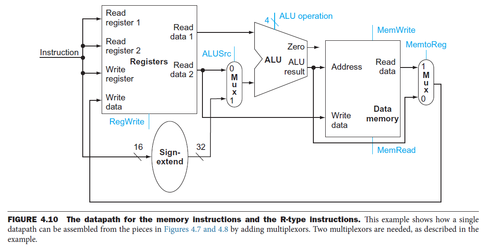

```mipsasm
and rd, rs1, rs2
```

### 4.1.1

按照时间顺序来说，涉及到的控制信号依次为
* ALUSrc
* ALU Operation
* MemToReg
* RegWrite

其中
* ALUSrc的值为`0`，表示ALU的第二个输入来自寄存器堆
* ALU Operation的值为AND所对应的代码`0000`，表示ALU需要进行与运算
* MemToReg的值为`0`，表示写入寄存器堆的值来自ALU的输出
* RegWrite的值为`1`，表示需要将与运算的结果写入寄存器堆

由于这是一个R型指令，不涉及内存的访问，因此MemRead和MemWrite两个控制信号的值均为`0`

### 4.1.2

用到的功能单元
* 寄存器堆Registers
* 决定ALU的第二个输入的二路选择器
* 算逻单元ALU
* 决定写入寄存器堆的值的来源的二路选择器

### 4.1.3

没用到的功能单元
* 符号扩展器
* 数据存储器

图中所有功能单元均产生输出

## 习题4.3

* 只有`lw`和`sw`需要用到数据存储器，共计35%
* 所有指令都需要用到指令存储器，共计100%
* 只有I型指令需要用到符号扩展器，共计74%
> [!NOTE]
> 官方答案认为跳转指令`j`也需要用到符号扩展器，但是根据教材图4.24所示，跳转指令`j`的数据通路并没有用到符号扩展器
* 即使某个时钟周期不需要使用符号扩展器的输出，符号扩展器也会照常产生输出，只不过这个输出会被忽略

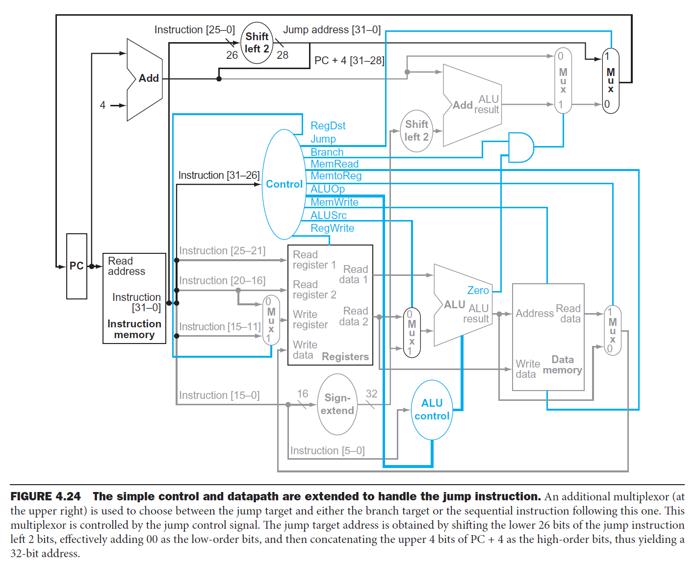

## 习题4.5

> [!NOTE]
> 本题不参与本次作业的评分。题干中给出的指令字，使用的是RISC-V指令集的格式。下面的解析中，会对与本题相关的RISC-V指令集的相关知识进行简要的介绍。感兴趣的同学可以自行作进一步的搜索。

```
   0     0     c     6     b     a     2     3 (hexadecimal)
0000  0000  1100  0110  1011  1010  0010  0011 (binary)
0000  000  01100  01101  011  10100  010  0011 (binary, reorganized)
imm[11:5]  rs2    rs1 funct3  imm[4:0]  opcode
```

未完待续

## 习题4.7

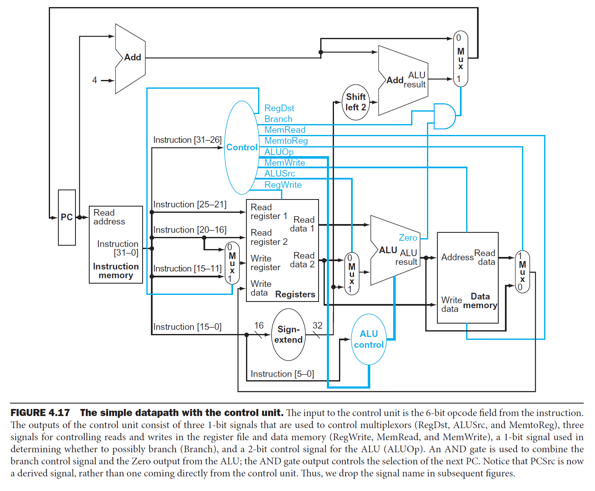

> [!NOTE]
> * **关键路径**指的是延迟最大的信号传输路径
> * 下面的分析中，假设线路本身没有延迟
> * `X`表示无关项，所有被置为`X`的控制信号，在实际中可以按照被置为`0`来理解
> * 只有在决定一个元器件的输出的所有输入全部到达之后，才能开始计算这个元器件的延迟

待办
* [ ] 题目中实际给出了控制单元的延迟，目前的解析中假设控制单元没有延迟

### R型指令

执行R型指令所经过的关键路径如下
* 从程序计数器中读取当前指令的地址，耗时 $30\text{ps}$
* 从指令存储器中读取当前指令，耗时 $250\text{ps}$，与此同时
  * 更新PC的数据通路发生了如下变化
    * PC值加4，耗时 $150\text{ps}$
    * 加上4以后的PC值到达了右上角二路选择器的0输入端
* 此时，控制单元识别到当前指令为R型指令，因此
  * 将`RegDst`信号置为`1`，表示将使用指令的第15位至第11位作为待写入寄存器的编号
  * 将`Branch`信号置为`0`，表示当前指令不是分支指令
  * 将`MemRead`信号置为`0`，表示当前指令不需要对数据存储器进行读操作
  * 将`MemtoReg`信号置为`0`，表示将使用ALU的输出作为写入寄存器堆的数据
  * 对`ALUOp`信号进行相应的设定，以确保ALU执行的是与指令类型相对应的运算
  * 将`MemWrite`信号置为`0`，表示当前指令不需要对数据存储器进行写操作
  * 将`ALUSrc`信号置为`0`，表示ALU的第二个输入来自寄存器堆
  * 将`RegWrite`信号置为`1`，表示当前指令需要对寄存器堆进行写操作
* 从寄存器堆中读取两个寄存器的值，耗时 $150\text{ps}$，与此同时
  * 更新PC的数据通路发生了如下变化
    * 由于`Branch`信号为`0`，与门产生值为`0`的输出，耗时 $5\text{ps}$
    * 加上4以后的PC值经过右上角的二路选择器，耗时 $25\text{ps}$
    * PC值更新，耗时 $20\text{ps}$
  * 待写入寄存器的编号经过由`RegDst`控制的二路选择器，到达寄存器堆的输入端，耗时 $25\text{ps}$
* 被读出的寄存器2的值经过由`ALUSrc`控制的二路选择器，耗时 $25\text{ps}$
* 在ALU中执行运算，耗时 $200\text{ps}$
* 运算结果经过由`MemtoReg`控制的二路选择器，耗时 $25\text{ps}$
* 运算结果被写入寄存器堆，耗时 $20\text{ps}$

共计 $30 + 250 + 150 + 25 + 200 + 25 + 20 = 700\text{ps}$

### `lw`指令

执行`lw`指令所经过的关键路径如下
* 从程序计数器中读取当前指令的地址，耗时 $30\text{ps}$
* 从指令存储器中读取当前指令，耗时 $250\text{ps}$，与此同时
  * 更新PC的数据通路发生了如下变化
    * PC值加4，耗时 $150\text{ps}$
    * 加上4以后的PC值到达了右上角二路选择器的0输入端
* 此时，控制单元识别到当前指令为`lw`指令，因此
  * 将`RegDst`信号置为`0`，表示将使用指令的第20位至第16位作为待写入寄存器的编号
  * 将`Branch`信号置为`0`，表示当前指令不是分支指令
  * 将`MemRead`信号置为`1`，表示当前指令需要对数据存储器进行读操作
  * 将`MemtoReg`信号置为`1`，表示将使用数据存储器的输出作为写入寄存器堆的数据
  * 对`ALUOp`信号进行相应的设定，以确保ALU执行的是**加法**运算
  * 将`MemWrite`信号置为`0`，表示当前指令不需要对数据存储器进行写操作
  * 将`ALUSrc`信号置为`1`，表示ALU的第二个输入来自符号扩展器
  * 将`RegWrite`信号置为`1`，表示当前指令需要对寄存器堆进行写操作
* 从寄存器堆中读取一个寄存器的值，耗时 $150\text{ps}$，与此同时
  * 更新PC的数据通路发生了如下变化
    * 由于`Branch`信号为`0`，与门产生值为`0`的输出，耗时 $5\text{ps}$
    * 加上4以后的PC值经过右上角的二路选择器，耗时 $25\text{ps}$
    * PC值更新，耗时 $20\text{ps}$
  * 待写入寄存器的编号经过由`RegDst`控制的二路选择器，到达寄存器堆的输入端，耗时 $25\text{ps}$
  * 立即数字段所在的数据通路发生了如下变化
    * 立即数字段经过符号扩展器，耗时 $50\text{ps}$
    * 经过符号扩展之后的立即数字段经过由`ALUSrc`控制的二路选择器，到达ALU的输入端，耗时 $25\text{ps}$
> [!NOTE]
> 官方答案认为要等到寄存器堆产生输出之后，由`ALUSrc`控制的二路选择器才能产生输出。然而，由于是`lw`指令，`ALUSrc`的值为`1`，不需要等待0输入端的数据到达即可产生输出。因此，我认为这个二路选择器并不位于`lw`指令执行的关键路径上。
* 在ALU中对基址和偏移量求和，耗时 $200\text{ps}$
* 利用得到的地址，从数据存储器中读出数据，耗时 $250\text{ps}$
* 读出的数据经过由`MemtoReg`控制的二路选择器，耗时 $25\text{ps}$
* 读出的数据被写入寄存器堆，耗时 $20\text{ps}$

共计 $30 + 250 + 150 + 200 + 250 + 25 + 20 = 925\text{ps}$

### `sw`指令

执行`sw`指令所经过的关键路径如下
* 从程序计数器中读取当前指令的地址，耗时 $30\text{ps}$
* 从指令存储器中读取当前指令，耗时 $250\text{ps}$，与此同时
  * 更新PC的数据通路发生了如下变化
    * PC值加4，耗时 $150\text{ps}$
    * 加上4以后的PC值到达了右上角二路选择器的0输入端
* 此时，控制单元识别到当前指令为`sw`指令，因此
  * 将`RegDst`信号置为`X`，因为当前指令不需要对寄存器堆进行写入操作
  * 将`Branch`信号置为`0`，表示当前指令不是分支指令
  * 将`MemRead`信号置为`0`，表示当前指令不需要对数据存储器进行读操作
  * 将`MemtoReg`信号置为`X`，因为当前指令不需要对寄存器堆进行写入操作
  * 对`ALUOp`信号进行相应的设定，以确保ALU执行的是**加法**运算
  * 将`MemWrite`信号置为`1`，表示当前指令需要对数据存储器进行写操作
  * 将`ALUSrc`信号置为`1`，表示ALU的第二个输入来自符号扩展器
  * 将`RegWrite`信号置为`0`，表示当前指令不需要对寄存器堆进行写操作
* 从寄存器堆中读取两个寄存器的值，耗时 $150\text{ps}$，与此同时
  * 更新PC的数据通路发生了如下变化
    * 由于`Branch`信号为`0`，与门产生值为`0`的输出，耗时 $5\text{ps}$
    * 加上4以后的PC值经过右上角的二路选择器，耗时 $25\text{ps}$
    * PC值更新，耗时 $20\text{ps}$
  * 立即数字段所在的数据通路发生了如下变化
    * 立即数字段经过符号扩展器，耗时 $50\text{ps}$
    * 经过符号扩展之后的立即数字段经过由`ALUSrc`控制的二路选择器，到达ALU的输入端，耗时 $25\text{ps}$
> [!NOTE]
> 官方答案认为要等到寄存器堆产生输出之后，由`ALUSrc`控制的二路选择器才能产生输出。然而，由于是`sw`指令，`ALUSrc`的值为`1`，不需要等待0输入端的数据到达即可产生输出。因此，我认为这个二路选择器并不位于`sw`指令执行的关键路径上。
* 此时，被读出的寄存器2的值已经到达数据存储器的输入端
* 在ALU中对基址和偏移量求和，耗时 $200\text{ps}$
* 利用得到的地址，向数据存储器中写入数据，耗时 $250\text{ps}$

共计 $30 + 250 + 150 + 200 + 250 = 880\text{ps}$

### `beq`指令

执行`beq`指令所经过的关键路径如下
* 从程序计数器中读取当前指令的地址，耗时 $30\text{ps}$
* 从指令存储器中读取当前指令，耗时 $250\text{ps}$，与此同时
  * 更新PC的数据通路发生了如下变化
    * PC值加4，耗时 $150\text{ps}$
    * 加上4以后的PC值到达了右上角二路选择器的0输入端
    * 加上4以后的PC值到达了右上角加法器的输入端
* 此时，控制单元识别到当前指令为`beq`指令，因此
  * 将`RegDst`信号置为`X`，因为当前指令不需要对寄存器堆进行写入操作
  * 将`Branch`信号置为`1`，表示当前指令是分支指令，同时，该信号到达与门的输入端
  * 将`MemRead`信号置为`0`，表示当前指令不需要对数据存储器进行读操作
  * 将`MemtoReg`信号置为`X`，因为当前指令不需要对寄存器堆进行写入操作
  * 对`ALUOp`信号进行相应的设定，以确保ALU执行的是**减法**运算
  * 将`MemWrite`信号置为`0`，表示当前指令不需要对数据存储器进行写操作
  * 将`ALUSrc`信号置为`0`，表示ALU的第二个输入来自寄存器堆
  * 将`RegWrite`信号置为`0`，表示当前指令不需要对寄存器堆进行写操作
* 从寄存器堆中读取两个寄存器的值，耗时 $150\text{ps}$，与此同时
  * 更新PC的数据通路发生了如下变化
    * 立即数字段经过符号扩展器，耗时 $50\text{ps}$
    * 扩展后的字段经过左移2位元器件，由于这个元器件实际上是一个分线器，并且这里的分析假设线路本身不存在延迟，因此，此时计算分支目标地址所需的偏移量已经到达右上角加法器的输入端
    * 右上角的加法器进行加法，在寄存器堆产生输出前，加法尚未完成
* 被读出的寄存器2的值经过由`ALUSrc`控制的二路选择器，耗时 $25\text{ps}$，与此同时
  * 更新PC的数据通路发生了如下变化
    * 右上角的加法器还在进行加法，并且仍未完成
* 在ALU中执行运算，耗时 $200\text{ps}$，与此同时
  * 更新PC的数据通路发生了如下变化
    * 右上角的加法器产生输出，耗时 $25\text{ps}$
    * 所得结果（即分支目标地址）到达右上角二路选择器的1输入端
* 此时，ALU的Zero输出到达与门的输入端
* 与门产生输出，耗时 $5\text{ps}$
* 此时，右上角二路选择器的三个输入全部到达
* 右上角二路选择器产生输出，耗时 $25\text{ps}$
* PC值被更新，耗时 $20\text{ps}$

共计 $30 + 250 + 150 + 25 + 200 + 5 + 25 + 20 = 705\text{ps}$

### I型算逻指令

执行I型算逻指令所经过的关键路径如下
* 从程序计数器中读取当前指令的地址，耗时 $30\text{ps}$
* 从指令存储器中读取当前指令，耗时 $250\text{ps}$，与此同时
  * 更新PC的数据通路发生了如下变化
    * PC值加4，耗时 $150\text{ps}$
    * 加上4以后的PC值到达了右上角二路选择器的0输入端
* 此时，控制单元识别到当前指令为I型算逻指令，因此
  * 将`RegDst`信号置为`0`，表示将使用指令的第20位至第16位作为待写入寄存器的编号
  * 将`Branch`信号置为`0`，表示当前指令不是分支指令
  * 将`MemRead`信号置为`0`，表示当前指令不需要对数据存储器进行读操作
  * 将`MemtoReg`信号置为`0`，表示将使用ALU的输出作为写入寄存器堆的数据
  * 对`ALUOp`信号进行相应的设定，以确保ALU执行的是与指令类型相对应的运算
  * 将`MemWrite`信号置为`0`，表示当前指令不需要对数据存储器进行写操作
  * 将`ALUSrc`信号置为`1`，表示ALU的第二个输入来自符号扩展器
  * 将`RegWrite`信号置为`1`，表示当前指令需要对寄存器堆进行写操作
* 从寄存器堆中读取一个寄存器的值，耗时 $150\text{ps}$，与此同时
  * 更新PC的数据通路发生了如下变化
    * 由于`Branch`信号为`0`，与门产生值为`0`的输出，耗时 $5\text{ps}$
    * 加上4以后的PC值经过右上角的二路选择器，耗时 $25\text{ps}$
    * PC值更新，耗时 $20\text{ps}$
  * 待写入寄存器的编号经过由`RegDst`控制的二路选择器，到达寄存器堆的输入端，耗时 $25\text{ps}$
  * 立即数字段所在的数据通路发生了如下变化
    * 立即数字段经过符号扩展器，耗时 $50\text{ps}$
    * 经过符号扩展之后的立即数字段经过由`ALUSrc`控制的二路选择器，到达ALU的输入端，耗时 $25\text{ps}$
> [!NOTE]
> 官方答案认为要等到寄存器堆产生输出之后，由`ALUSrc`控制的二路选择器才能产生输出。然而，由于是I型算逻指令，`ALUSrc`的值为`1`，不需要等待0输入端的数据到达即可产生输出。因此，我认为这个二路选择器并不位于I型算逻指令执行的关键路径上。
* 在ALU中执行运算，耗时 $200\text{ps}$
* 运算结果经过由`MemtoReg`控制的二路选择器，耗时 $25\text{ps}$
* 运算结果被写入寄存器堆，耗时 $20\text{ps}$

共计 $30 + 250 + 150 + 200 + 25 + 20 = 675\text{ps}$

### 最小时钟周期

由于是单周期CPU，时钟周期的长度取决于延迟最长的一条指令，即`lw`指令，为 $925\text{ps}$

## 画出`sw $r3, 16($r1)`指令的数据路径与控制信号

> [!NOTE]
> * 6-bit op + 5-bit rs + 5-bit rt + 16-bit imm
> * $r1对应rs
> * $r3对应rt

**以下为优秀作业展示**

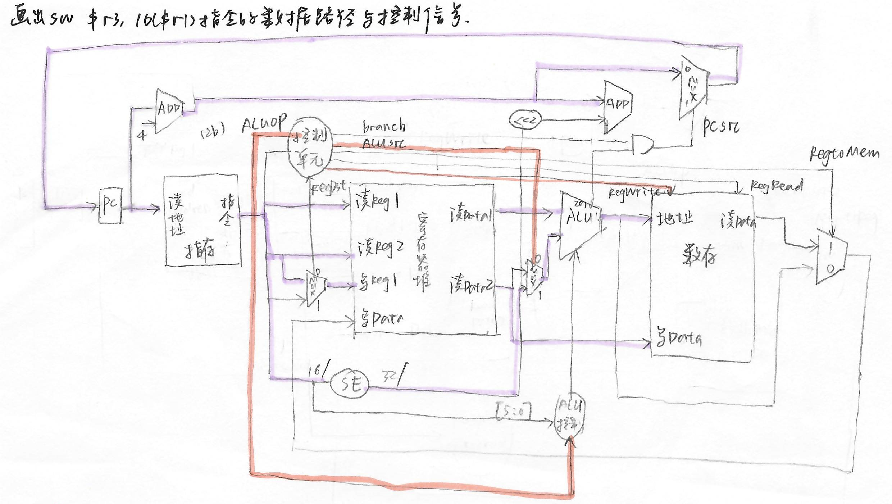

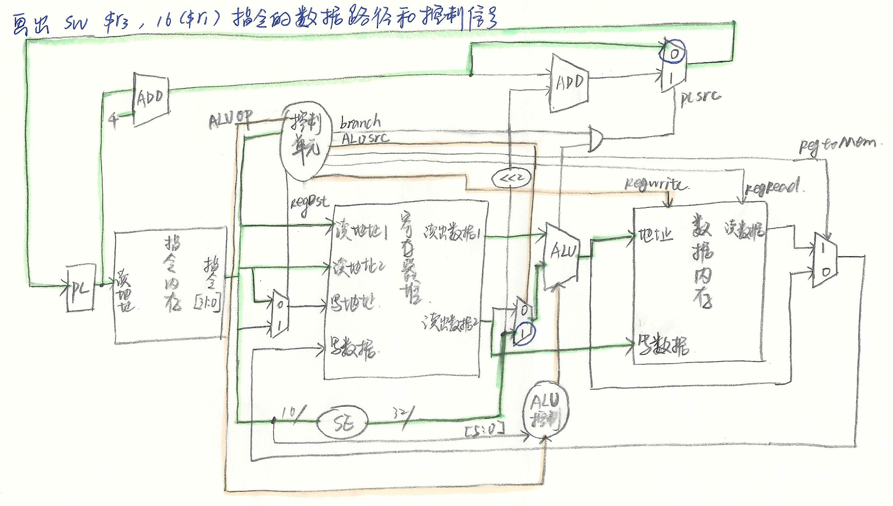

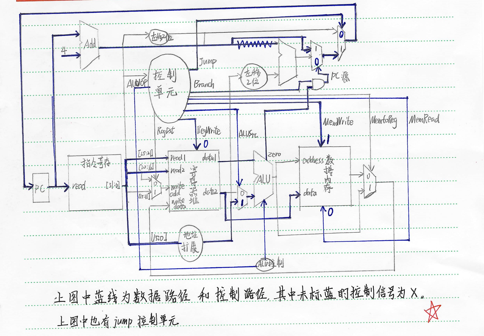

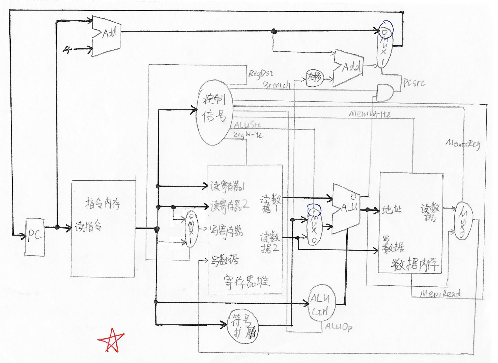

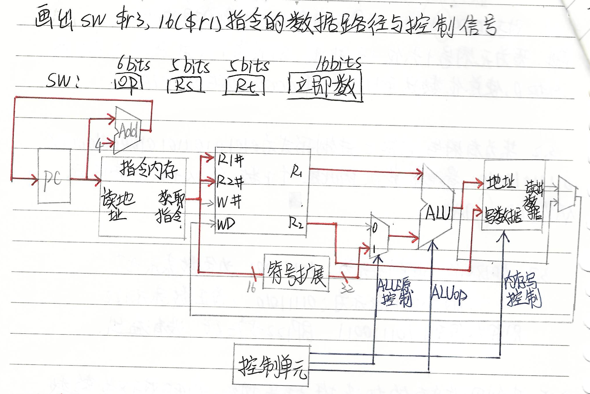

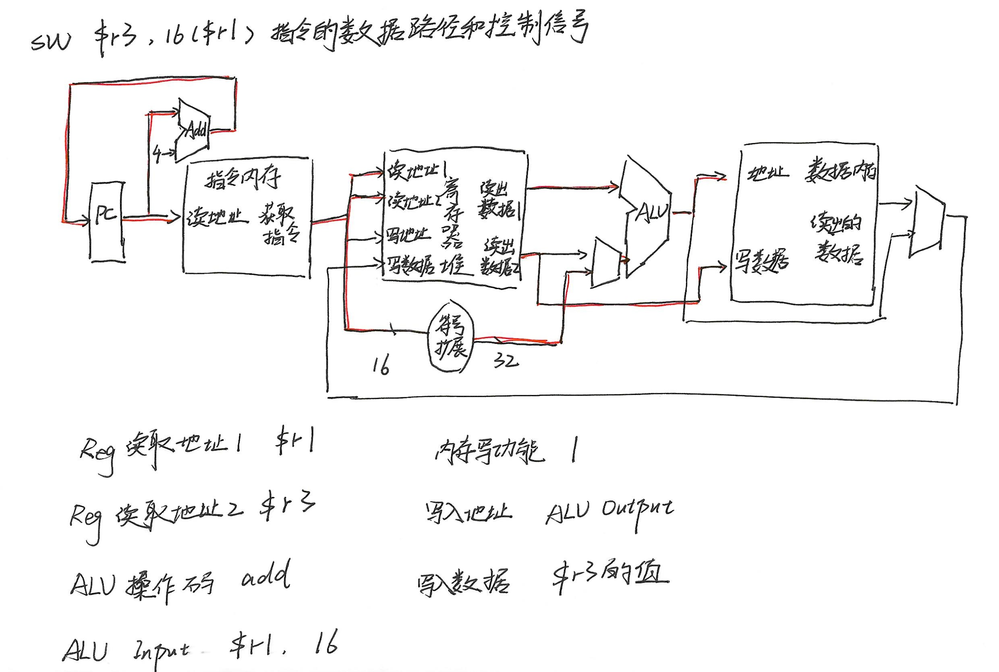

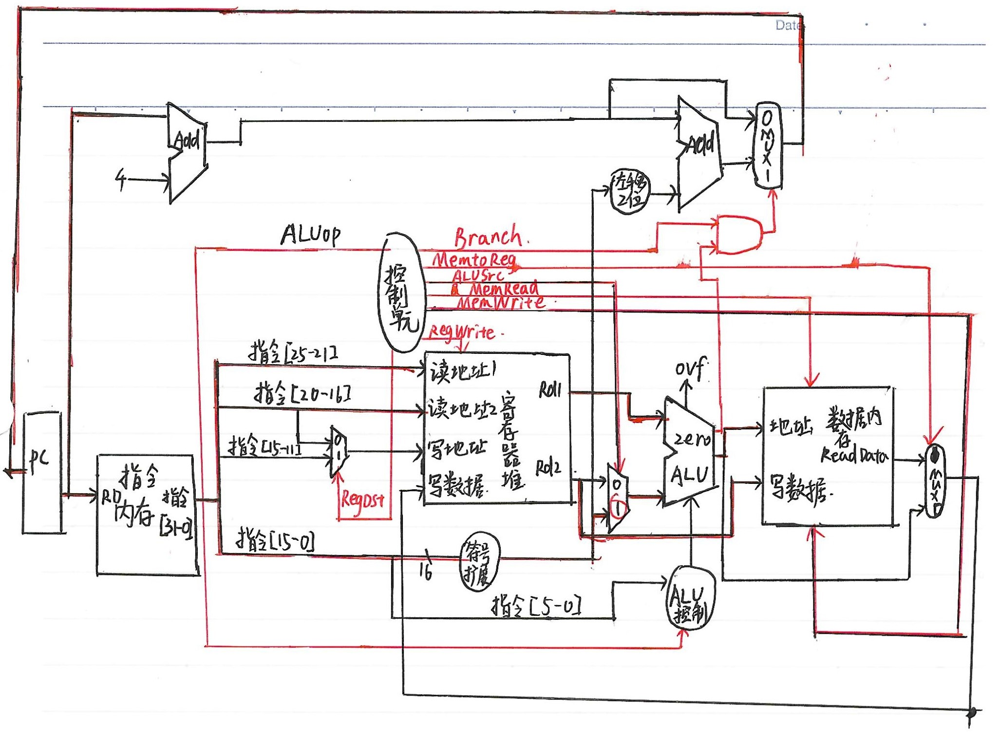

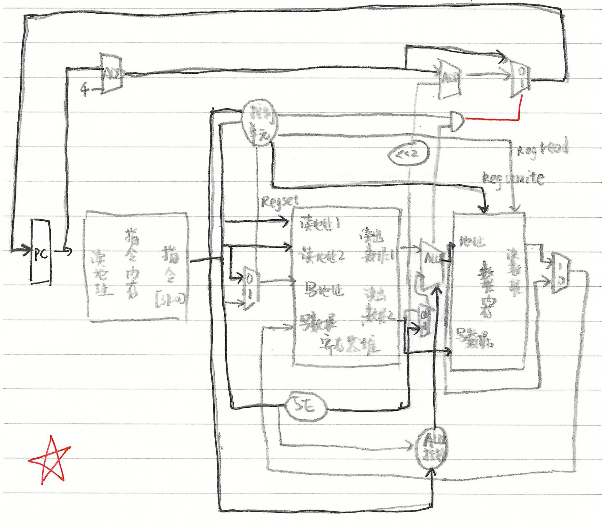
