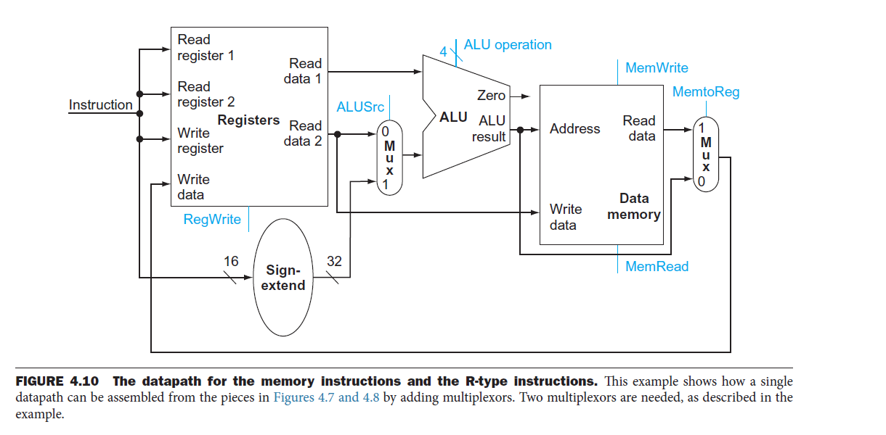
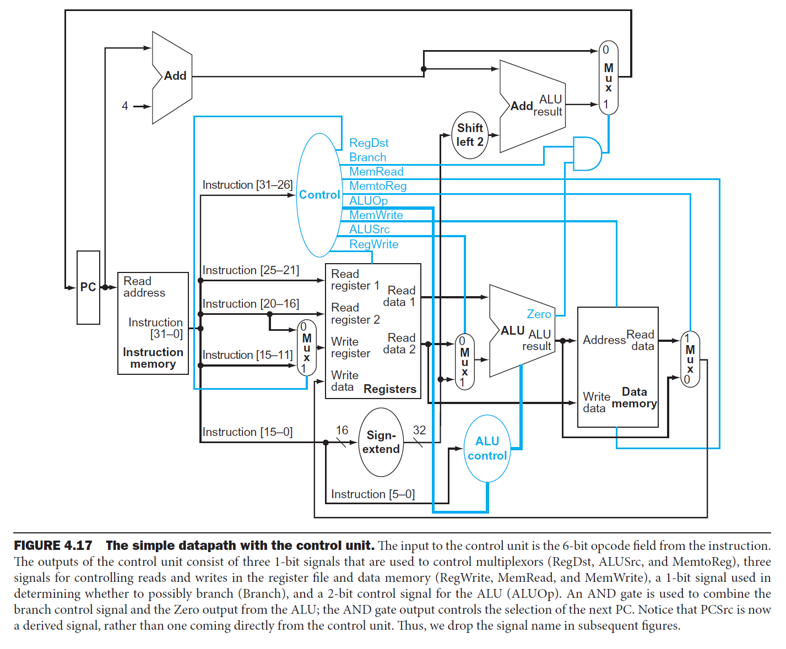

# 作业03解析 - 第4章相关内容

## 写在前面

在这里和大家说声抱歉。我自己对于教材第4章，也就是处理器设计相关的内容并不熟悉，因此在编写解析的时候可能会有不准确甚至错误的地方。并且，由于教材以及官方的参考答案中均存在一定的错误或者没有交代清楚的地方，因此，本次作业在批改时，直接跳过了一些争议较大的题目。对于与官方答案不一致的地方，我尽量说清楚自己的理由。如果有做得不到位的地方，请各位同学批评指正。

## 习题4.1



```mipsasm
and rd, rs1, rs2
```

### 4.1.1

按照时间顺序来说，涉及到的控制信号依次为
* ALUSrc
* ALU Operation
* MemToReg
* RegWrite

其中
* ALUSrc的值为`0`，表示ALU的第二个输入来自寄存器堆
* ALU Operation的值为AND所对应的代码`0000`，表示ALU需要进行与运算
* MemToReg的值为`0`，表示写入寄存器堆的值来自ALU的输出
* RegWrite的值为`1`，表示需要将与运算的结果写入寄存器堆

由于这是一个R型指令，不涉及内存的访问，因此MemRead和MemWrite两个控制信号的值均为`0`

### 4.1.2

用到的功能单元
* 寄存器堆Registers
* 决定ALU的第二个输入的二路选择器
* 算逻单元ALU
* 决定写入寄存器堆的值的来源的二路选择器

### 4.1.3

没用到的功能单元
* 符号扩展器
* 数据存储器

图中所有功能单元均产生输出

## 习题4.3

* 只有`lw`和`sw`需要用到数据存储器，共计35%
* 所有指令都需要用到指令存储器，共计100%
* 只有R型指令不需要用到符号扩展器，其他指令共计76%
  * [ ] 为什么跳转指令`j`也需要用到符号扩展器
* 即使某个时钟周期不需要使用符号扩展器的输出，符号扩展器也会照常产生输出，只不过这个输出会被忽略

## 习题4.5

说明：本题不参与本次作业的评分。题干中给出的指令字，使用的是RISC-V指令集的格式。下面的解析中，会对与本题相关的RISC-V指令集的相关知识进行简要的介绍。感兴趣的同学可以自行作进一步的搜索。

待填充

## 习题4.7



说明
* **关键路径**指的是延迟最大的信号传输路径
* 下面的分析中，假设控制单元没有延迟

### R型指令

执行R型指令所经过的关键路径如下
* 从程序计数器中读取当前指令的地址，耗时 $30\text{ps}$
* 从指令存储器中读取当前指令，耗时 $250\text{ps}$，与此同时
  * 更新PC的数据通路发生了如下变化
    * 加上4以后的PC值到达了右上角二路选择器的0输入端，耗时 $150\text{ps}$
* 此时，控制单元识别到当前指令为R型指令，因此
  * 将`RegDst`信号置为`1`，表示将使用指令的第15位至第11位作为待写入寄存器的编号
  * 将`Branch`信号置为`0`，表示当前指令不需要使用分支目标地址
  * 将`MemRead`信号置为`0`，表示当前指令不需要对数据存储器进行读操作
  * 将`MemtoReg`信号置为`0`，表示将使用ALU的输出作为写入寄存器堆的数据
  * 对`ALUOp`信号进行相应的设定，以确保ALU执行正确的运算
  * 将`MemWrite`信号置为`0`，表示当前指令不需要对数据存储器进行写操作
  * 将`ALUSrc`信号置为`0`，表示ALU的第二个输入来自寄存器堆
  * 将`RegWrite`信号置为`1`，表示当前指令需要对寄存器堆进行写操作
* 从寄存器堆中读取两个寄存器的值，耗时 $150\text{ps}$，与此同时
  * 更新PC的数据通路发生了如下变化
    * 由于`Branch`信号为`0`，与门产生值为`0`的输出，耗时 $5\text{ps}$
    * 加上4以后的PC值经过右上角的二路选择器，耗时 $25\text{ps}$
    * PC值更新，耗时 $20\text{ps}$
  * 待写入寄存器的编号经过由`RegDst`控制的二路选择器，到达寄存器堆的输入端，耗时 $25\text{ps}$
* 被读出的寄存器2的值经过由`ALUSrc`控制的二路选择器，耗时 $25\text{ps}$
* 在ALU中执行运算，耗时 $200\text{ps}$
* 运算结果经过由`MemtoReg`控制的二路选择器，耗时 $25\text{ps}$
* 运算结果被写入寄存器堆，耗时 $20\text{ps}$

共计 $30 + 250 + 150 + 25 + 200 + 25 + 20 = 700\text{ps}$

### `lw`指令

共计 $30 + 250 + 150 + 200 + 250 + 25 + 20 = 925\text{ps}$

### `sw`指令

共计 $30 + 250 + 150 + 200 + 250 = 880\text{ps}$

### `beq`指令

### 第5小问

### 第6小问

## 画出`sw $r3, 16($r1)`指令的数据路径与控制信号

待填充
