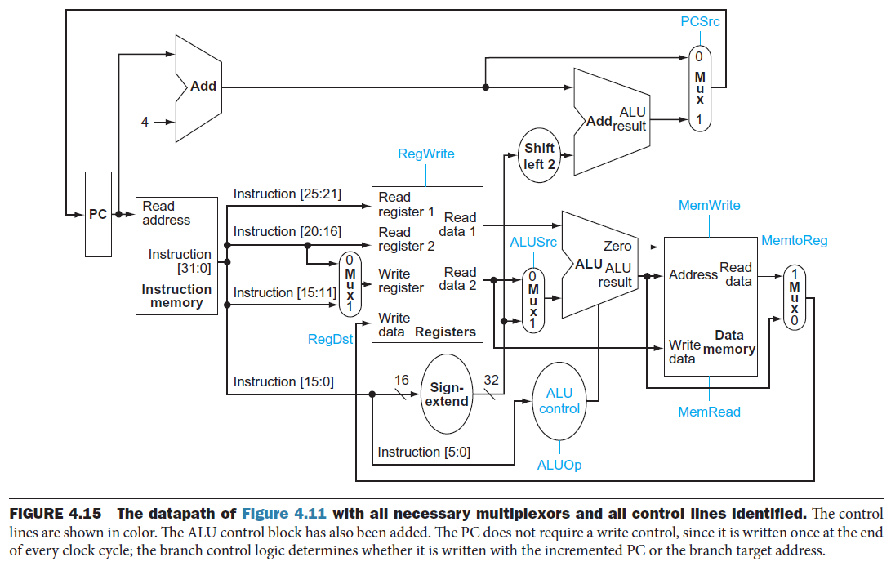

# 作业03解析 - 第4章相关内容

## 写在前面

在这里和大家说声抱歉。我自己对于教材第4章，也就是处理器设计相关的内容并不熟悉，因此在编写解析的时候可能会有不准确甚至错误的地方。加上官方的参考答案也有错讹之处，因此，本次作业在批改时直接跳过了一些争议较大的题目。对于与官方答案不一致的地方，我尽量说清楚自己的理由。如果有做得不到位的地方，请各位同学批评指正。

## 习题4.1


```mipsasm
and rd, rs1, rs2
```

### 4.1.1

按照时间顺序来说，涉及到的控制信号依次为
* ALUSrc
* ALU Operation
* MemToReg
* RegWrite

其中
* ALUSrc的值为`0`，表示ALU的第二个输入来自寄存器堆
* ALU Operation的值为AND所对应的代码`0000`，表示ALU需要进行与运算
* MemToReg的值为`0`，表示写入寄存器堆的值来自ALU的输出
* RegWrite的值为`1`，表示需要将与运算的结果写入寄存器堆

由于这是一个R型指令，不涉及内存的访问，因此MemRead和MemWrite两个控制信号的值均为`0`

### 4.1.2

用到的功能单元
* 寄存器堆Registers
* 决定ALU的第二个输入的二路选择器
* 算逻单元ALU
* 决定写入寄存器堆的值的来源的二路选择器

### 4.1.3

没用到的功能单元
* 符号扩展器
* 数据存储器

图中所有功能单元均产生输出

## 习题4.3

* 只有`lw`和`sw`需要用到数据存储器，共计35%
* 所有指令都需要用到指令存储器，共计100%
* 只有R型指令不需要用到符号扩展器，其他指令共计76%
  * [ ] 为什么跳转指令`j`也需要用到符号扩展器
* 即使某个时钟周期不需要使用符号扩展器的输出，符号扩展器也会照常产生输出，只不过这个输出会被忽略

## 习题4.5

说明：本题不参与本次作业的评分。

## 习题4.7



**关键路径**指的是延迟最大的信号传输路径

执行R型指令所经过的关键路径如下
1. 从程序计数器中读取当前指令的地址，耗时 $30\text{ps}$
2. 从指令存储器中读取当前指令，耗时 $250\text{ps}$
> [!NOTE]
> 在第2步结束前，还发生了PC值的更新，具体如下
> * PC值加4，耗时 $150\text{ps}$
> * 加上4的PC值经过由`PCSrc`控制的二路选择器，耗时 $25\text{ps}$
>   * **由于不是分支指令，因此`PCSrc`的值为`0`，不需要等待分支目标地址计算完成即可进入当前子路径的下一阶段**
> * 将新的PC值写入PC，耗时 $20\text{ps}$
3. 从寄存器堆中读取两个寄存器的值，耗时 $150\text{ps}$
> [!NOTE]
> 在第3步结束前，待写入寄存器的值已经经过由`RegDst`控制的二路选择器，到达寄存器堆的输入端，耗时 $25\text{ps}$
4. 从寄存器堆中读出的寄存器2的值经过由`ALUSrc`控制的二路选择器，耗时 $25\text{ps}$
5. 在ALU中执行运算，耗时 $200\text{ps}$
6. 运算结果经过由`MemtoReg`控制的二路选择器，耗时 $25\text{ps}$
7. 将运算结果写入寄存器堆，耗时 $20\text{ps}$

共计 $30 + 250 + 150 + 25 + 200 + 25 + 20 = 700\text{ps}$

执行`lw`指令所经过的关键路径如下
1. 从程序计数器中读取当前指令的地址，耗时 $30\text{ps}$
2. 从指令存储器中读取当前指令，耗时 $250\text{ps}$
> [!NOTE]
> 在第2步结束前，还发生了PC值的更新
3. 从寄存器堆中读取一个寄存器的值，耗时 $150\text{ps}$
> [!NOTE]
> 在第3步结束前，待写入寄存器的值已经经过由`RegDst`控制的二路选择器，到达寄存器堆的输入端，耗时 $25\text{ps}$
> [!NOTE]
> 在第3步结束前，ALU的第二个输入已经准备好，具体如下
> * 指令的立即数字段经过符号扩展器，耗时 $50\text{ps}$
> * 符号扩展器的输出经过由`ALUSrc`控制的二路选择器，耗时 $25\text{ps}$
>   * **由于是`lw`指令，因此`ALUSrc`的值为`1`，因此不需要等待寄存器堆读出寄存器2的值**
4. 在ALU中将基址与偏移量相加，耗时 $200\text{ps}$
5. 按照得到的地址，从数据存储器中读出数据，耗时 $250\text{ps}$
6. 读出的数据经过由`MemtoReg`控制的二路选择器，耗时 $25\text{ps}$
7. 将数据写入寄存器堆，耗时 $20\text{ps}$

共计 $30 + 250 + 150 + 200 + 250 + 25 + 20 = 925\text{ps}$

## 画出`sw $r3, 16($r1)`指令的数据路径与控制信号
