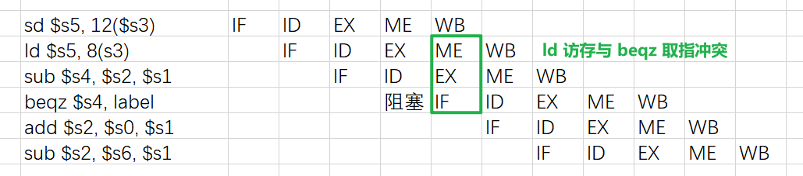
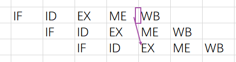

# 作业04解析

by 李兆坤

## 作业的主要问题

如果遇到不理解的概念，可以画图辅助，尤其是流水线相关内容，空想容易出错

如果解析和第一次答疑的相关内容还不能解决对第四章的某些疑惑，可以在企业微信上问我

**单周期数据通路**

部分同学可能对单周期数据通路不太清晰，最好的方法还是自己动手去画，熟悉常见指令的数据通路，具体可以参考第一次答疑的 `单周期数据通路.pdf` 、[4.12.5](###4.12.5) 的解析和课本相关内容

**流水线数据通路**

部分同学可能对流水线数据通路不太清晰，具体可以参考第一次答疑的 `流水线数据通路.pdf` 和课本相关内容

**流水线冒险**

流水线冒险包括结构冒险、数据冒险和控制冒险，具体可以参考第一次答疑的 `流水线冒险.pdf` 和课本相关内容

**照抄答案** 

部分参考答案有明显错误，注意自己的思考

## 4.9

使用 4.7 的延时表进行计算

4.7 中的最大时延（lw）按 950 ps 和 925 ps 均可，但 925 ps 更符合实际（详见 4.7 的解析）

### 4.9.1

改进前: 950/925 ps

改进后: 950/925 ps + 300 ps = 1250/1225 ps

### 4.9.2

950 / (1250 * 0.95) = 0.8

925 / (1225 * 0.95) = 0.79

**解析**

一般单周期的 CPI = 1 (每条指令执行一个时钟周期，cycle per instruction)

用 CPU 时间衡量性能: CPU time = I\*CPI\*T = IT

CPU 时间越长说明相同任务执行速度越慢，注意分子分母位置

### 4.9.3

50/48.7 ps

**解析**

设改进前的时钟周期为 T=950 ps ，改进后的时钟周期为 T'

则性能提升需要 (Tn) / (T'*0.95n) > 1 (相等时性能不变)

解得 T' < 1000 ps

所以 ALU 最长延迟为 T'-T=50 ps

另一种结果: 48.7 ps

## 4.10

使用 4.7 的延时表和 4.3 的指令使用频度表进行计算

### 4.10.1

950 / (960*(1-(25%+10%)*12%)) = 1.03

### 4.10.2 

性能变化: 提升了 3%

开销变化: 增加了 4%

**解析**

开销计算

改变前:

| PC | I-Mem | Register file | ALU | D-Mem | Sign Extend | Controls | adders | muxes | single gates |
|----|----|----|----|----|----|----|----|----|----|
| 5 | 1000 | 200 | 100 | 2000 | 100 | 1000=500\*2 | 30\*2 | 10\*3 | 1*1 |

合计 4496 ps

改变后:

| PC | I-Mem | Register file | ALU | D-Mem | Sign Extend | Controls | adders | muxes | single gates |
|----|----|----|----|----|----|----|----|----|----|
| 5 | 1000 | **400** | 100 | 2000 | 100 | 1000=500\*2 | 30\*2 | 10\*3 | 1*1 |

合计 4696 ps

4496 / 4696 = 0.9574

### 4.10.3

从严格的数学角度来看，添加更多寄存器是没有意义的，因为新的CPU每单位性能的成本更高（3%的性能提升却增加了4%的开销）。然而，这种简单的计算并没有考虑到性能的效用。例如，在实时系统中，3%的性能可能会决定是否满足最后期限。在这种情况下，这种改进完全值得4%的额外成本。

## 4.12

### 4.12.1

无需新增功能模块

### 4.12.2

1. 将寄存器堆修改为每周期可写两个寄存器
2. 增加 ALU 功能，使之将从寄存器堆读取的一个数据可以原封不动地传入寄存器堆的写数据口 1

### 4.12.3

增加一条不通过 ALU 的总线，将从寄存器堆读取的另一个数据直接传入寄存器堆的写数据口 2

### 4.12.4

额外增加一个 RegWrite 信号

### 4.12.5

如下图所示，绿线即为 swap 指令执行时的数据通路：


**解析**

读寄存器1 和 写寄存器2 均为 rs 的寄存器号，从 读数据1 写回 写数据2

读寄存器2 和 写寄存器1 均为 rt 的寄存器号，从 读数据2 写回 写数据1

## 4.16

### 4.16.1

流水线: max(250,350,150,300,200)=350 ps

非流水线: 250+350+150+300+200=1250 ps

### 4.16.2

流水线: 350*5=1750 ps

非流水线: 1250 ps

### 4.16.3

ID 级，因为其时延最长，且每次要么只读要么只写（可以拆分为只用一半时间）

拆分后 350/2=175 ps

max(250,175,150,300,200)=300 ps

## 4.21

### 4.21.1 

加速比 = 1.4\*n\*250 / 1.05\*n\*300 = 1.11 (CPI=1)

### 4.21.2 

设 y 为程序中用的 NOP 指令百分比

因为目标是带旁路的流水线性能提高，所以有: 300(1 + y)\*n < 250*1.4\*n

解得: y < 16.7%.

### 4.21.3 

300(1 + y)\*n < 250(1 + x)\*n

解得: y < (250x − 50)/300

### 4.21.4 

最好的情况是旁路可以消除所有的 NOP 指令

此时有: 300n > 250\*1.075\*n

所以带旁路的流水线并不能使该程序执行更快 

### 4.21.5 

y 必须大于 0: 0 < (250x − 50)/30

解得: x > 0.2

## 4.22

参考答案里寄存器用 x29、x16 等表示，实际上是 risc-v 架构的寄存器号表示

但课本正文部分（习题中可能有部分）并没有这种表示的说明

部分同学未加思索直接照抄

### 4.22.1

若使指令正常运行，则需产生阻塞，流水线图如下所示：


**解析**

若无阻塞，存在结构冒险，以及 sub 和 beqz 的数据冒险（sub 的 WB 阶段后才能将值写回 $s4），如下图所示：


若只有一个阻塞，依然存在结构冒险，以及 sub 和 beqz 的数据冒险，如下图所示：



### 4.22.2

并不一定。因为无论代码如何重排，只能解决数据冒险和控制冒险，但不能减少本题中的结构冒险（每条指令都需要取指，包括 NOP 指令）。

### 4.22.3

必须使用硬件处理。因为即使是空指令也需要取指，插入空指令依然会使空指令的 IF 和访存指令的 ME 冲突。

**解析**

注意区别阻塞（stall）和空指令（nop），前者 CPU 被阻塞不执行计算，后者是 CPU 仍执行计算，只不过是运算空指令

### 4.22.4

每次访存操作都会产生一次阻塞， 4.8 中的访存指令（lw 和 sw）占比 36%

## 4.26

### 4.26.1

```bash
# EX to 1st only:
add x11, x12, x13
add x14, x11, x15
add x5, x6, x7
# 注意 x11

# MEM to 1st only:
ld x11, 0(x12)
add x15, x11, x13
add x5, x6, x7
# 注意 x11

# EX to 2nd only:
add x11, x12, x13
add x5, x6, x7
add x14, x11, x12
# 注意 x11

# MEM to 2nd only:
ld x11, 0(x12)
add x5, x6, x7
add x14, x11, x13
# 注意 x11

# EX to 1st and EX to 2nd:
add x11, x12, x13
add x5, x11, x15
add x16, x11, x12
# 注意 x11 和 x12
```

### 4.26.2

```bash
# EX to 1st only: 2 nops
add x11, x12, x13
nop
nop
add x14, x11, x15
add x5, x6, x7

# MEM to 1st only: 2 stalls
ld x11, 0(x12)
nop
nop
add x15, x11, x13
add x5, x6, x7

# EX to 2nd only: 1 nop
add x11, x12, x13
add x5, x6, x7
nop
add x14, x11, x12

# MEM to 2nd only: 1 nop
ld x11, 0(x12)
add x5, x6, x7
nop
add x14, x11, x13

# EX to 1st and EX to 2nd: 2 nops
add x11, x12, x13
nop
nop
add x5, x11, x15
add x16, x11, x12
```

### 4.26.3

考虑如下指令序列：

```bash
ld x11, 0(x5) # MEM to 2nd --- one stall
add x12, x6, x7 # EX to 1st --- two stalls
add x13, x11, x12
add x28, x29, x30
```

如果单独分析，则需要插入 3 条 nop 指令

但整体分析后，只需要插入两条，顺便也解决了 ld 的数据冒险：

```bash
ld x11, 0(x5)
add x12, x6, x7
nop
nop
add x13, x11, x12
add x28, x29, x30
```

### 4.26.4

结合 4.26.2 分析，这些 RAW 相关产生的额外阻塞为：

0.05\*2 + 0.2\*2+ 0.05\*1 + 0.1\*1 + 0.1\*2 = 0.85

所以 CPI = 1.85

阻塞占比 0.85 / 1.85 = 46%

### 4.26.5

MME to 1st 无法通过旁路解决，必须阻塞一个周期

CPI = 1 + 20%\*1 = 1.2

占比 0.2 / 1.2 = 17 %

**解析**

数据冒险，就是某条指令在 EX 阶段需要某个寄存器的值进行计算，但该寄存器中的值还未被之前的指令写回更新，且只有 EX 和 MEM 阶段会产生需要更新的值

只要能在 EX 阶段前，前面数据相关的指令都可以完成 WB ，就不会有数据冒险

考虑连续三条指令：


题中的前四种 RAW 依次如绿、蓝、紫、橙线所示，第五种无非是绿线和紫线的组合

可以看到，除了蓝线，其他数据都是沿着时间轴流动，可以通过旁路解决；但蓝线（MEM to 1st）却是垂直于时间轴，是不可能通过旁路解决的，因为二者处在同一时钟周期，该周期结束后 MEM 才会产生值

### 4.26.6

只从 EX/MEM 流水线寄存器进行转发：

| RAW Type | Stalls |
|----|----|
| EX to 1st | 0 | 
| MEM to 1st | 2 |
| EX to 2nd | 1 |
| MEM to 2nd | 1 |
| EX to 1st and 2nd | 1 |

CPI = 0\*5% + 2\*20% + 1\*25% + 1 = 1.65

只从 MEM/WB 流水线寄存器进行转发：

| RAW Type | Stalls |
|----|----|
| EX to 1st | 1 | 
| MEM to 1st | 1 |
| EX to 2nd | 0 |
| MEM to 2nd | 0 |
| EX to 1st and 2nd | 1 |

CPI = 0\*15% + 1\*35% + 1 = 1.35

**解析**

考虑 EX to 2nd 类型的 RAW ，当第二条指令执行到 EX 阶段时，基本指令执行到 WB 但未完成，所以  EX to 2nd 需要的是 MEM/WB 流水线寄存器进行转发：



如果遇到不理解的概念，可以画图辅助

### 4.26.7

|  | 无旁路 | 仅 EX/MEM | 仅 MEM/WB | 全旁路 |
|----|----|----|----|----|
| CPI (Cycle Per Instruction) | 1.85 | 1.65 | 1.35 | 1.2 |
| 时钟周期 T | 120 | 120 | 120 | 130 |
| 指令数 IC (Instruction Count) | n | n | n | n |
| CPU 执行时间 = CPI\*IC\*T | 222n | 198n | 162n | 156n |
| 加速比 Speed-up | 1 | 1.12 | 1.37 | 1.42 |

**解析**

- 全旁路只是无法解决 MEM to 1st ，如 4.26.5
- 时钟周期取所有阶段最长的
- 注意加速比计算时分子分母位置

### 4.26.8

在穿越机制下，CPI = 1 ，时钟周期 = 230 ，指令数仍为 n 

所以加速比 = (1.2\*130) / (1\*230) = 0.68

反而减慢

**解析**

这种穿越机制可能就是在同一时钟周期内，打通相邻 ME 与 EX 阶段，一种方法和“寄存器堆前半周期写后半周期读”类似，把阶段再细分后做约定

### 4.26.9

当考虑 4.26.6 中的 EX/MEM 转发时， EX-to-1st 不会产生停顿，但 EX-to-1st 和 EX-to-2nd 会产生阻塞，所以这是两种情况

但是，无论转发类型如何，所有 MEM-to-1st 都会导致阻塞，进而导致第二条指令的 ID 阶段与基本指令的 WB 阶段重叠，如此在第二条指令执行 EX 前，数据已经写回，故不存在数据冒险了

## 4.28

### 4.28.1

25% \* (1-45%) \* 3 = 0.4125

CPI = 1.4125

**解析**

分支在 EX 级执行，没有延迟槽，所以分支预测错误的代价相当于 3 条 NOP (==课本 P238 图4-61==)

式中各项为: 分支指令占比 \* 分支错误概率 \* 错误代价 = 增加的 CPI

### 4.28.2

CPI = 1 + 25% \* (1-55%) \* 3 = 1.3375

### 4.28.3

CPI = 1 + 25% \* (1-85%) \* 3 = 1.1125

### 4.28.4

CPI = 1 + 12.5% \* (1-85%) \* 3 = 1.05625

加速比 = 1.1125 / 1.05625 = 1.05325

### 4.28.5

指令总数 I = (12.5% + 1) \* n = 1.125n

此时分支指令占比 0.125n / 1.125n = 1/9 = 11%

CPI = 1 + 1/9 \* (1-85%) \* 3 = 1.05

加速比 = (n \* 1.1125 \* T) / (1.125n \* 1.05 \* T) = 0.9418

**解析** 

答案中的 0.91 实际上是把替换的 ALU 指令当做和分支指令无关的指令插入到剩下分支指令后，从而使预测错误的代价降低

但题中并没有明确指出这些替换的 ALU 指令和原来分支指令的关系

==如果这样做，需要说明，并且 4.28.4 和 4.28.5 对此处理应一致==，即:

4.28.4 的错误代价降为 2， 4.28.5 的错误代价降为 1

照此计算，这两题的结果分别为 **1.07229** 和 **0.91**

### 4.28.6

0.8\*1 + 0.2\*x = 0.85

解得: x=25%

## 4.31

参考答案里寄存器用 x29、x16 等表示，实际上是 risc-v 架构的寄存器号表示

但课本正文部分（习题中可能有部分）并没有这种表示的说明

部分同学未加思索直接照抄

### 4.31.1


`ld`: lw

`sd`: sw

`..`: stall


### 4.31.2

加速比为 1

**解析**

单发射:

会有一个“取数-使用”阻塞（lw - sub），循环内部因此需要经历 9 个时钟周期，再加上条件判断，每次循环需要经历 10 个时钟周期

```bash
lw $t3, 8($t1)
<stall>
sub $t4, $t2, $t3
```

双发射:

如 4.31.1 所示，28 个时钟周期中，有 4\*2 = 8 个时钟周期用于流水线的填充与清空，所以 2 次循环实际上经历了 20 个时钟周期，每次循环经历 10 个时钟周期

此外，双发射几乎将硬件数量增加了一倍，性价比很低

### 4.31.3

```bash
beqz $s1, DONE
li $s0, 0
jal ENT
TOP:
slli $t0, $s0, 3 # 8*i, 数组取值需转换为字节偏移
add $t1, $s2, $t0 # 数组 a 本次循环的“基址”
lw $t2, 0($t1) # a[i]
lw $t3, 8($t1) # a[i+1]
addi $s0, $s0, 2 # 在 lw-sub 见插入无关指令, 消除 取数-用数 冒险
sub $t4, $t2, $t3 # a[i]-a[i+1]
add $t5, $s3, $t0 # b[i]
sw $t4, 0($t5)
ENT:
bne $s0, $s1, TOP
DONE:
```

消除了 取数-用数 冒险，没有额外 stall ，因而性能更好


**解析**

指针性能更高，额外节省一个时钟周期

本题改为使用指针而非数组对应的 C 代码:

```c
for (i = 0; i != j; i += 2) {
    *b = *a - *(a+1);
    b+=2;
    a+=2;
}
```

MIPS 汇编:

```bash
beqz $s1, DONE
li $s0, 0
jal ENT
TOP:
lw $t2, 0($s2) # *a
lw $t3, 8($s2) # *(a+1)
addi $s0, $s0, 2 # 在 lw-sub 见插入无关指令, 消除 取数-用数 冒险
sub $t4, $t2, $t3 # a[i]-a[i+1]
sw $t4, 0($s3)
addi $s2, $s2, 16
addi $s3, $s3, 16
ENT:
bne $s0, $s1, TOP
DONE:
```

相比于数组实现，省去了代码:

```bash
slli $t0, $s0, 3 # 8*i, 数组取值需转换为字节偏移
```

而是直接计算地址，把

```bash
add $t1, $s2, $t0 # 数组 a 本次循环的“基址”
add $t5, $s3, $t0 # b[i]
```

替换为:

```bash
addi $s2, $s2, 16 #下次循环开始的 a 和 b 地址
addi $s3, $s3, 16
```