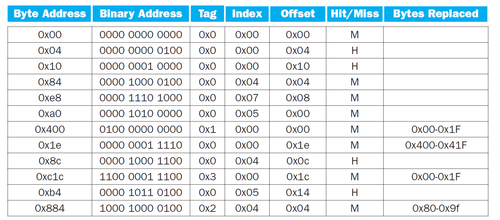

# 第 5 次作业 - 解析

## 重要知识点总结

### 局部性原理

判断自己是否理解了什么是局部性原理，很简单：能不能用大白话把时间局部性和空间局部性解释出来。
* 时间局部性：相同的数据很快会被再次访问
* 空间局部性：附近的数据很快会被访问

个人认为，将局部性分成时间 (temporal) 局部性和空间 (spatial) 局部性，具有一定的误导性。因为
* 时间局部性的定义中也涉及**空间** (**same location/address** will presumably be accessed soon)
* 空间局部性的定义中也涉及**时间** (nearby locations will presumably be accessed **soon**)

因此，不必教条地理解 temporal 和 spatial 这两个词。

## 书后习题 5.1

### 第 1 小问

16 字节的 cache 块中可以存放 $\frac{16}{\frac{32}{8}} = \frac{16 \times 8}{32} = 4$ 个 32 位的整数。

### 第 2 小问

```c
for (I = 0; I < 8; I++)
    for (J = 0; J < 8000; J++)
        A[I][J] = B[I][0] + A[J][I]
```

首先我们需要列举出这段代码中的所有变量/位置
* 外层循环变量 `I`
* 内层循环变量 `J`
* 数组 A 的基地址 `A`
* 数组 A 中的元素 `A[I][J]`
* 数组 A 中的元素 `A[J][I]`
* 数组 B 的基地址 `B`
* 数组 B 中的元素 `B[I][0]`

然后，注意到前一小问中告诉我们 1 个 cache 块可以存放 4 个 32 位整数。

由于题干中没有明确说明，因此我们假设数组 A 和 B 的元素均为 32 位整数。

结合时间局部性的定义可知，上述代码对以下变量/位置的访问均具有时间局部性特征
* 外层循环变量 `I`
* 内层循环变量 `J`
* 数组 A 的基地址 `A`
* 数组 B 的基地址 `B`
* 数组 B 中的元素 `B[I][0]`

变量 `I` 的时间局部性体现为
* 每次外层循环结束后的自增
* 每次到内存中访问 `A[I][J]` 等元素时，需要引用 `I` 计算该元素的地址

同理，变量 `J` 也具有时间局部性。

变量 `A` 的时间局部性体现为
* 每次到内存中访问 `A[I][J]` 等元素时，需要引用 `A` 计算该元素的地址

同理，变量 `B` 也具有时间局部性。

最后，考虑内层循环中的赋值语句
```c
A[I][J] = B[I][0] + A[J][I]
```
**注意，在内层循环中，变量 `I` 的值始终保持不变。**因此，每次计算 `A[I][J]` 的新值时都需要引用 B 中的同一个元素 `B[I][0]`，可见对该元素的访问也具有明显的时间局部性特征。

### 第 3 小问

由于
* 时间局部性关注的是对**相同**位置的访问
* 空间局部性关注的是对**相邻**位置的访问

因此二者是互斥的。

于是我们只需考虑如下的两个访问位置
* 数组 A 中的元素 `A[I][J]`
* 数组 A 中的元素 `A[J][I]`

实际上是两对**关系**
* 数组 A 中同一行的两个相邻元素 `A[I][J]` 和 `A[I][J+1]`
* 数组 A 中同一列的两个相邻元素 `A[J][I]` 和 `A[J+1][I]`

由于 C 语言采用**行优先**存储，即数组的同一行中的元素在内存中连续存放，因此对 `A[I][J]` 的访问显示出空间局部性。

### 第 4 小问

> [!NOTE]
> 本题题干表述不清，作答时言之成理即可。

```matlab
for I=1:8
    for J=1:8000
        A(I,J)=B(I,1)+A(J,I);
    end
end
```

既然题干说的是**矩阵**计算，因此我们假设数组 A
* 每一行的元素个数均相等
* 每一列的元素个数也相等

即不会出现锯齿状数组的情况。

由于
* 形如 `A(I,J)` 的所有元素中，地址最小的是 `A(1,1)`，地址最大的是 `A(8,8000)`
* 形如 `A(J,I)` 的所有元素中，地址最小的是 `A(1,1)`，地址最大的是 `A(8000,8)`
* 形如 `B(I,1)` 的所有元素中，地址最小的是 `B(1,1)`，地址最大的是 `B(8,1)`

因此
* 数组 A 至少需要有 8000 行和 8000 列。
* 数组 B 至少需要有 8 行和 1 列。

于是
* 数组 A 至少存放了 $8000 \times 8000 = 64,000,000$ 个整数，共需要 $\frac{64,000,000}{4} = 16,000,000$ 个 cache 块。
* 数组 B 至少存放了 $8 \times 1 = 8$ 个整数，共需要 $\frac{8}{4} 2$ 个 cache 块

因此一共需要 $16,000,002$ 个 cache 块。

### 第 5 小问

与第 2 小问相同。访问以下变量/位置时会显示出时间局部性：
* 外层循环变量 `I`
* 内层循环变量 `J`
* 数组 A 的基地址 `A`
* 数组 B 的基地址 `B`
* 数组 B 中的元素 `B[I][0]`

### 第 6 小问

由于 Matlab 采用**列优先**存储，因此与第 3 小问相反，显示出空间局部性特征的是 `A[J][I]`。

此外，每次外层循环的变量 `I` 的值发生改变时，对 `B[I][0]` 的访问也具有空间局部性。

## 书后习题 5.5

```
 31               10 9     5 4      0
+-------------------+-------+--------+
|        tag        | index | offset |
+-------------------+-------+--------+
```

### 第 1 小问

offset 字段一共有 5 位 (0,1,2,3,4)

其中低 2 位 0,1 用于表示字内地址

剩下的 3 位决定了 cache 块的大小为 $2^3 = 8$ 个字

### 第 2 小问

cache 中的条目/项 (entry) 数是由 index 字段的位数决定的

本题中 index 字段一共 5 位 (5,6,7,8,9)

因此 cache 中一共有 $2^5 = 32$ 个 entry

### 第 3 小问

cache 的每一个 entry 除了要存储数据之外，还需要存储用于管理数据的**元数据**

本题中，一个 entry 有如下几部分构成
* $8 \times 32 = 256$ 个比特，其中
  * 8 是一个 cache 块所包含的字的个数
  * 32 是一个字所包含的比特数
* 22 比特的 tag
* 有效位 (valid bit)

因此，总位数与数据位数之比等于 $\frac{256 + 22 + 1}{256} = 1.08984375$

> [!NOTE]
> 如果忘记考虑有效位，得到的结果是 $\frac{256 + 22}{256} = 1.0859375$

### 第 4,5,6 小问



怎么画这个表
* 将每次访问的地址展开为二进制，即可得到对应的 tag/index/offset 字段
* 第一次访存时 cache 是空的，因此一定 miss
* 相同 index 相同 tag 则命中
* 相同 index 不同 tag 则需要置换出之前的 cache 块

一共 12 次访存，命中 4 次，因此命中率等于 $\frac{4}{12} = 0.33$

要获得 cache 的最终状态，顺着上表捋一遍即可：从下往上看，对于每一个索引值，只要出现过一次，就不用再往上看了。

```
<index, tag, data>
<0, 3, Mem[0xc00]-Mem[0xc1f]>
<4, 2, Mem[0x880]-Mem[0x89f]>
<5, 0, Mem[0x0a0]-Mem[0x0bf]>
<7, 0, Mem[0x0e0]-Mem[0x0ff]>
```

`Mem[0xc00]-Mem[0xc1f]` 表示主存 (memory) 中从编号为 `0xc00` 的字节开始，到编号为 `0xc1f` 的字节结束，一共 32 个字节的数据。下同。

> [!NOTE]
> 之所以要按照索引值排序，是因为索引值实际上就是 cache 中每个 entry 的编号。

## 书后习题 5.10

### 第 1 小问

送分题。

* P1 的时钟频率等于 $\frac{1}{0.66} = 1.52$ GHz
* P2 的时钟频率等于 $\frac{1}{0.90} = 1.11$ GHz

### 第 2 小问

$$\text{AMAT} = \text{time for a hit} + \text{miss rate} \times \text{miss penalty}$$

从官方答案来看，需要沿用第 1 小问的假设，即 L1 cache 的命中时间等于 P1 和 P2 的时钟周期。

于是需要将访存时间换算成周期数
* 对 P1 来说，访问一次内存需要 $\lceil \frac{70}{0.66} \rceil= 107$ 个时钟周期
* 对 P2 来说，访问一次内存需要 $\lceil \frac{70}{0.90} \rceil= 78$ 个时钟周期

将已知信息代入公式得
* P1 的 AMAT 等于 $1 + 0.08 \times 107 = 9.56$ 个时钟周期，也就是 $9.56 \times 0.66 = 6.31$ ns
* P2 的 AMAT 等于 $1 + 0.06 \times 78 = 5.68$ 个时钟周期，也就是 $5.68 \times 0.90 = 5.11$ ns

### 第 3 小问

以 P2 为例。

在不考虑 cache 缺失时，由于 CPI 等于 1，根据 CPI 的定义，执行一条指令需要 1 个时钟周期。

现在考虑指令 cache 的缺失，根据已知条件，有 6% 的指令在取指阶段发生了缺失，需要额外的 78 个周期去访问内存。

进一步考虑数据 cache 的缺失，已知有 36% 的指令需要访问数据存储器，这些指令中的 6% 在访存时发生了缺失。

综上，P2 的 CPI 等于 $1 + 0.06 \times 78 + 0.36 \times 0.06 \times 78 = 7.3648$

由于 P2 的时钟周期等于 0.9 ns，因此执行一条指令平均需要 $7.3648 \times 0.9 = 6.62832 \approx 6.63$ ns

同理得，P1 的 CPI 等于 $1 + 0.08 \times 107 + 0.36 \times 0.08 \times 107 = 12.6416$

因而 P1 执行一条指令平均需要 $12.6416 \times 0.66 \approx 8.34$ ns

所以 P2 更快。

> [!NOTE]
> 本题中假定指令 cache 和数据 cache 的缺失率相同，实际情况中应该将二者分开考虑。

> [!NOTE]
> 通过这道题目我们发现在评估存储系统的性能时，AMAT 和 CPI 是两个不同的指标。

### 第 4 小问

访问一次 L2 cache 需要 $\lceil \frac{5.62}{0.66} \rceil = 9$ 个时钟周期。

每次访存至少需要 1 个时钟周期。

其中的 8% 会发生 L1 cache 的缺失，因而需要额外的 9 个时钟周期访问 L2 cache。

对 L2 cache 的访问中，95% 会再次缺失，需要额外的 107 个时钟周期访问主存。

因此 AMAT 等于 $1 + 0.08 \times (9 + 0.95 \times 107) = 9.852$ 个时钟周期。

与第 2 小问相比，增加 L2 cache 之后，AMAT 变差了。

### 第 5 小问

与第 3 小问的思想相同。

$$\underbrace{1 + 0.08 \times (9 + 0.95 \times 107)}_{\text{AMAT}} + 0.36 \times \overbrace{\color{red} 0.08 \color{normal} \times (9 + 0.95 \times 107)}^{\text{AMAT} - 1} = 13.03872$$

> [!NOTE]
> 之所以可以使用形如
> $$\text{AMAT} + \text{访存指令所占比例} \times (\text{AMAT} - 1)$$
> 的公式计算 CPI，是因为假设了 L1 指令 cache 与 L1 数据 cache 的缺失率相同。
> 
> 如果将上面标红的 0.08 改成其他的值，就需要考虑指令 cache 缺失率与数据 cache 缺失率的比值问题。

### 第 6 小问

只需求解一个简单的不等式

$$9 + 107 x < 107$$

解得 $x < \frac{98}{107} \approx 0.916$

### 第 7 小问

本质上还是一个简单的不等式求解问题，没有太多需要注意的，只是它比较繁琐，所以需要细心

$$\text{CPI}_{\text{P1}} \times 0.66 < 6.62832$$
```math
\text{CPI}_{\text{P1}} = \text{AMAT}_{\text{P1}} + 0.36 \times (\text{AMAT}_{\text{P1}} - 1)
```
$$\text{AMAT}_{\text{P1}} = 1 + 0.08 \times (9 + 107 y)$$

我自己的习惯是，为了确保计算的精度，在最后一步之前统一用精确值进行计算
```
>>> (5.96832 - 9 * 1.36 * 0.08 * 0.66) / (1.36 * 0.08 * 0.66 * 107)
0.6926633015143185
```
最终结果和官方答案一致

$$y < 0.693$$
