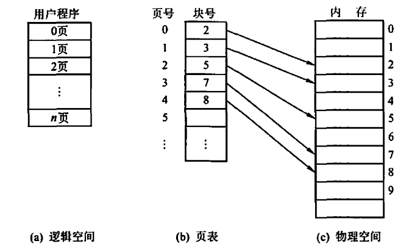
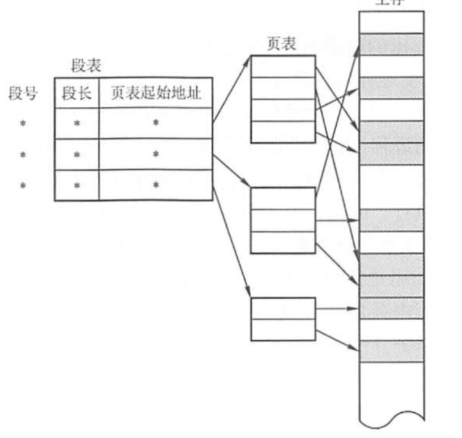
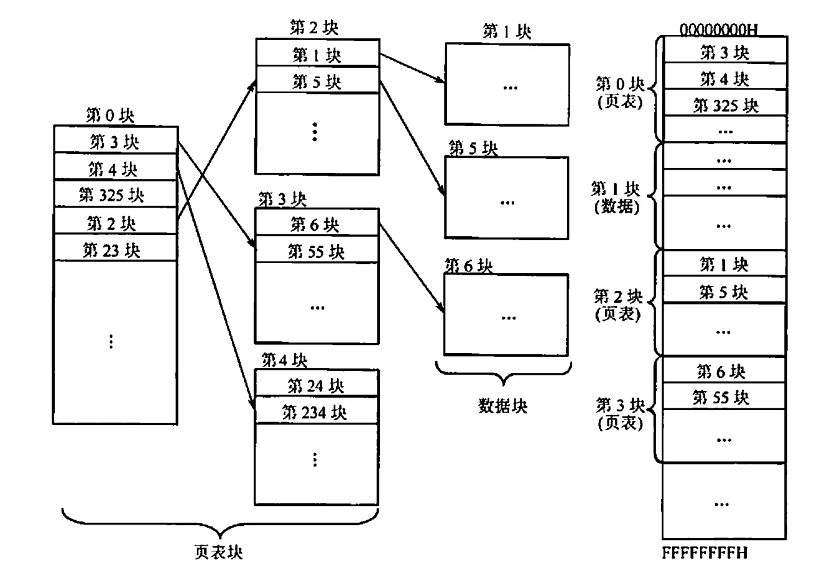

# 作业06解析

by 李兆坤

## 作业的主要问题

如果解析相关内容还不能解决对第五章的某些疑惑，可以在企业微信上问我

**对存储器的失效度量不清晰**

部分同学可能对存储器的失效度量不太清晰，具体可以参考[5.13](##5.13) 的解析和课本相关内容

**对虚拟存储器技术有误解**

具体可以参考[简答题](##简答题)和课本相关内容

**对分页等内存管理机制不太理解**

具体可以参考[简答题](##简答题)、[5.18](##5.18)的解析和课本相关内容

这里简单梳理一下：

```
连续内存分配 -> 非连续内存分配（分页、分段） -> 虚拟存储器技术建立在非连续内存分配上
                    |
                    |-减少驻留内存的页表大小 -> 多级页表、反向页表
                    |-增快地址转换速度 -> TLB
```

**照抄答案** 

部分参考答案有明显错误，注意自己的思考

## 5.13

一年按 365 天算

### 5.13.1

MTBF = MTTF + MTTR = 3 年 1 天 = 1096 天 = 26304 小时

### 5.13.2

可用性 = MTTF / (MTTF + MTTR) = 1095 天 / 1096 天 = 99.90875912%

### 5.13.3

可用性接近于 1.0

随着廉价存储器的出现，MTTR 接近于 0 是可行的（可以在无故障时间内更换存储器，从而节省修复时间 MTTR），但迁移数据可能需要大量时间

### 5.13.4

此时 MTTR 可能成为可用性的主要因素

但如果 MTTF 也同等重要，甚至比 MTTR 的增长更快，那么也需要考虑 MTTF

比如 MTTF=1000MTTR ，可用性并不会因为 MTTR 的增大而降低太多

**解析**

可以参考==课本 P313 5.5.1 失效的定义==相关内容

在此对 MTTF 、AFR 、MTTR 和 MTBF 以及可用性、可靠性和可信性做简单的辨析

> 一般地，我们使用可靠性、可用性和可信性来度量存储器的失效相关性能。
>
> ==可靠性==（Reliability）是一个系统或模块从开始使用到失效的时间间隔，有以下两种度量方式：平均无故障时间（Mean Time To Failure, **MTTF**）和年失效率（Annual Failure Rate, **AFR**）。二者关系如下：
> $$AFR = \frac{\text{time of a year}}{MTTF} $$
>
> ==可用性==（Availability）是指系统正常工作时间在两次服务中断间隔时间中所占比例：
> $$\text{Availability} = \frac{MTTF}{MTTF + MTTR} $$
>
> 其中平均修复时间（Mean Time To Repair, **MTTR**）来度量服务中断后恢复的时间（简单来说就是维修时间）
>
> 我们还可以定义 `MTTF+MTTR` 为平均失效间隔（Mean Time Between Failure, **MTBF**），也就是从上次失效开始计算到这次失效的时间间隔：上次失效后，需要先进行修复（MTTR），然后经历无故障时间（MTTF），到再次失效
>
> 因此，我们可以通过增加 MTTF 和减小 MTTR 来提高存储器的可用性，即
增加硬件使用时间和减少故障维修花费时间。
>
> ==可信性==（Dependability）简单理解就是系统中的数据是否可信（比如有没有错误、怎么判断有没有错误），也是系统失效衡量的一个方面（不可信的数据当然失效），侧重系统中的数据本身。可信性无法像可用性和可靠性一样量化，但可以通过冗余技术提高可信性（汉明编码等）。

## 简答题

1. 简述为什么需要虚拟内存？

    主要有两方面的原因：
    1. 在逻辑上扩充内存，使用外存上的空间来扩充内存空间，避免内存受限影响程序设计（最初的原因）
    2. 允许多个程序之间有效且安全地共享内存，比如各进程拥有自己的虚拟地址空间从而相互隔离

    此外，也可以简化应用程序对内存的使用（虚拟地址空间布局较为固定，对于各进程页基本一致，但直接操作物理地址很麻烦）
                                
2. 什么是虚拟地址？什么是物理地址？二者什么关系？

    虚拟地址空间是程序在执行时使用的地址空间，不同进程可以有相同的逻辑地址，因为这些相同的逻辑地址可以映射到主存的不同位置（物理地址）
    
    物理地址空间是指内存中物理单元的集合，它是地址转换的最终地址，对用户（程序员、进程都算用户）不可见

    操作系统通过内存管理部件（MMU）将进程使用的逻辑地址转换为物理地址，当程序访问一个虚拟地址时，MMU 会查找它的页表，将虚拟地址转换为对应的物理地址

3. 分页存储管理
    - 为何要进行分页？

        分页是虚拟内存管理的一种技术，它将虚拟地址空间和物理地址空间分割成固定大小的块，分别对应称为“页”（pages）和“页框”（page frames）。
    
        分页可以更有效地使用物理内存，因为它可以精确地分配所需的内存量，而不需要大块连续的内存（比如 1 GB 内存可能不是连续的，通过分页技术可以使程序使用这些分散的内存）；此外，分页也可以利用局部性原理。

    - 什么是页表？页表存放于什么位置？

        页表是操作系统用来将虚拟地址映射到物理地址的数据结构。每个进程都有自己的页表，其中包含了该进程所有页的映射信息，存放在内存中（狭义上，页表就是指内存中的页表；广义上，TLB 中缓存的内容也是页表的一部分）。

    - 为什么说有了页表后，从内存的某一位置取数，可能需要访问 2 次内存？
    
        第一次访存是为了将页表中的虚拟地址转换为物理地址

        第二次访存是按照第一次访存得到的物理地址取对应位置的数

**解析**

以上可能涉及较多操作系统的概念，没有接触过的同学可能不太理解，在这里简单解释一下。

==进程==简单理解就是内存中运行的各种程序，它是动态的，平常在磁盘上的可执行程序文件本身不是进程。

相信大家都知道==虚拟存储器技术==是用外存为了扩大内存，但具体是怎么做到的呢？

首先，内存是具有易失性的（掉电数据就不存在了），平常我们使用 Word ，如果电脑突然关机，之前没有保存的内容在重启后也不会存在了；而外存（磁盘）是可持久化存储的，文件（包括可执行程序文件）都存放在上面。

考察一个进程启动的过程，当双击磁盘上的可执行程序，操作系统便会加载可执行程序的进程镜像（镜像简单理解就是该程序在内存中的一个副本，但肯定会有差异的，不然文件就直接在磁盘上运行了）到内存中。进程只能运行在内存中，如果必须一次性全部加载，那么外存再大也无济于事，因为程序不可能直接运行在外存上，但你又要程序全部加载才能运行——那自然而然，我们就会想到，能不能一次只加载进程当前需要的部分，暂时不需要的放在外存上，这样就给内存腾出空间了。

这样，我们就可以利用外存扩充内存了，这个外存中暂时存放内存中数据的区域就是交换区，对应的操作就是换入/换出。当然，上面的实现还需要一个重要条件——进程无需一次性装载，自然会想到“分块”思想，典型的“分块”就是分页技术。

现在，简单说完了虚拟内存技术和分页技术的联系，即**虚拟内存的实现需要建立在离散分配的内存管理方式的基础**，我们也应该能理解虚拟内存技术的三个重要特点：
- 多次性：无须在作业运行时一次性地全部装入内存，而允许被分成多次调入内存运行，即只需将当前要运行的那部分程序和数据装入内存即可开始运行。以后每当要运行到尚未调入的那部分程序时，再将它调入。
- 对换性：是指无须在作业运行时一直常驻内存，在进程运行期间，允许将那些暂不使用的程序和数据从内存调至外存的对换区（换出）， 待以后需要时再将它们从外存调至内存（换入）。
- 虚拟性：从逻辑上扩充内存的容量， 使用户所看到的内存容量远大于实际的内存容量。这是虚拟存储器所表现出的最重要特征，也是实现虚拟存储器的最重要目标。

我们要清楚，虚拟内存技术是建立在分页技术之上的，而分页技术本身并不一定只为虚拟内存技术服务。一个没有虚拟内存技术的内存，也可以使用分页机制来离散分配内存，即==分页技术==是一种非连续分配方式。

连续和非连续分配很好理解，但要注意是站在内存的角度来说的。比如内存中有一块连续的区域大小为 1 GB，那么就可以连续分配给任何大小不超过 1 GB 的进程，只不过有可能留下碎片，因为不能进程都恰好 1 GB；当碎片累积得多了，虽然这些碎片大小总和能有 1 GB，但无法连续分配给一个 1 GB 的进程了。非连续分配就是讲这些碎片组织起来，通过一定机制可以将其分配给对应进程，典型技术就是分页了。我们可以通过分页技术将内存分成小块（一般是 4 KB 大小），相当于“碎片”了，被称为“==页框==”（page frames）。

其实也可以理解为什么说内存是外存的 cache 了：当进程想访问某个数据，它在内存中就命中，不在内存中就缺失，去外存中调换。课本上更侧重从存储器的角度来讲述虚拟存储技术，直接按 cache 相关思想来理解也是没问题的，毕竟 cache 也是分块的，这些思想都是类似的。分页机制中的页也有类似的问题，页过大，虽然命中率提高，但离散分配的优势削弱了；页过小，就不能很好地利用局部性。*按自己的方式，理解就好*。

当然，这些碎片都是内存中实际存在，它们的地址当然是物理地址。回过头来看进程，进程怎么知道这些碎片在哪里？

它当然可以在编程时，直接操作物理地址，但这样对程序员和操作系统都不友好（效率啊安全啊，等等）。所以编程实际上操作的是逻辑地址（虚拟地址），每个进程都有自己的虚拟地址空间，布局完全一致，里面也对应地进行了分块，被称为“==页==”（page）。从虚拟页索引物理页框，就需要借助==页表==（将虚拟地址映射到物理地址的数据结构），如下所示：



如果想要用一个虚拟地址找到一个物理地址，还需要一个页内偏移。页表只能找到物理页框，但在这么大的页里具体需要哪个物理地址，就要用页内偏移来索引了。这也就是为什么**课本P322 图5-25**上虚拟页号需要转换为物理页号，页偏移字段直接和物理页号拼接（虚拟页和物理页框大小是一样的，可以直接用虚拟地址中的页偏移）。

上面提到，每个进程都有自己独自的虚拟地址空间，一个 32 位虚拟地址的地址空间就有 $2^{32} = 4$ GB 大小。我们不可能为所有的这些虚拟地址都分配对应的物理地址，那成千上万的进程的开销更无法估量了。一般操作系统只会给每个进程分配几个物理页框，称为这个进程的驻留集。当驻留集中的物理页框在页表中已被虚拟页号占满时，如果有新的虚拟页号需要进行地址转换，就会发生缺页，会淘汰一个虚拟页号，把它对应的物理页框供新的虚拟页号使用，同时从外存中调入该虚拟页对应的页到该物理页框中。与 cache 寻址类似，也会有一系列标志位来辅助这个替换过程。

以上内容为了方便理解，言语比较直白，如有疑问，可以参考课本或相关资料，也可以直接来问我。

关于虚拟存储器技术和分页机制等，在操作系统也会再次学到（只不过到时候更多地是站在进程的角度而不是存储器的角度），其他相关课程用的也比较多，建议大家尽可能地掌握。

## 5.18

通过简答题的解析，可以发现分页管理方式存在的两个主要问题： 
1. 每次访存操作都需要进行逻辑地址到物理地址的转换，地址转换过程必须足够快，否则访存速度会降低； 
2. 每个进程引入页表，用于存储映射机制，页表不能太大，否则内存利用率会降低。

快表（TLB）技术用来处理问题 1 ，多级页表用来处理问题 2

### 5.18.1

$2^{31}$, 8 GB

**解析**

页大小（偏移）为 4 KB = $2^{12}$ B，占虚拟地址的低 12 位

虚拟地址总长 43 位

所以虚拟页号为高 43 - 12 = 31 位

每个虚拟页号都对应着一个页，该虚拟页号可以索引 $2^{31}$ 个页，也就需要 $2^{31}$ 个页表项

每个页表项大小为 4 B

所以存放这个单级页表需要 $2^{31} \times 4 B = 8 GB$

### 5.18.2 

二级页表即可

2 次，第一次访存按照一级页号查找一级页表中的二级页表，第二次访存按照二级页号查找对应二级页表中的物理地址

**解析**

为什么需要多级页表呢？以本题为例，虚拟页号有 31 位，要在单级页表中为每个虚拟页号映射一个物理页框，那么这个页表就会很长很大（8 GB）。让这么大的页表常驻内存的连续区域，开销是很大的。

因此，我们可以使用分级思想来解决。在进程执行时，只需要将上一级页表调入内存即可，进程的页表和进程本身的页面可在后面的执行中再调入内存。

多级页表虽然节约了存储空间，却带来了时间上的开销，所以它其实是一个“时间换空间”的策略。原本进行一次地址转换，现在要多次，所以页表级数一般不会太多。

如果不限制顶级页表的大小（这里的限制感觉意思是页表的大小是否一致），那么可以自定义每个页表段的大小，被称为段页式管理，如下图所示：



前面内容讲过，从用户视角来看，程序中会有数据段、代码段等等，这种不限制页表大小的分段式存储管理就可以，反映程序的逻辑结构并有利于段的共享和保护；分页存储管理能有效地提高内存利用率，对操作系统较为友好——二者结合就是段页式管理。

建立多级页表的目的在于建立索引，以便不用浪费主存空间去存储无用的页表项，也不用盲目地顺序式查找页表项。

关于 TLB ，详见 [5.19](##5.19) 的解析

### 5.18.3

足够大

**解析**

4 Byte = 32 bit ，去除有效位，可以索引 $2^{31}\times 4$ KB = 8 TB 大小的空间

其中，这个 4 KB 指的是页内偏移

固定了页的大小，就是纯多级页表了，不涉及什么段式存储的概念，下图是一个典型的二级页表：



### 5.18.4

4

**解析**

每级页表只能保存 4 KiB /4 B = $2^{10}$ 个页表项。

除去页内索引，43 位地址有 31 位的虚拟页号，将虚拟页号分级索引，需要 $\lceil \frac{31}{10} \rceil = 4$ 级页表

### 5.18.5

4 MB 和一些 Hash 碰撞代价

正常情况下，一个虚拟地址对应一个物理地址，一次访存查询反向页表即可获得物理地址

最坏情况下，一个虚拟地址对应所有物理地址，需要额外的标记位等辅助，逐个比较这些物理地址

**解析**

反向页表（Inverse Page Table）是一种内存管理技术，它与传统的页表相反，用于将物理内存地址映射到虚拟内存地址，具体的虚拟地址到物理地址的转换过程：
1. 确定虚拟页号：从虚拟地址中提取虚拟页号。
2. 查找反向页表：使用虚拟页号作为索引，在反向页表中查找对应的条目。
3. 获取物理页号：在找到的反向页表条目中，会有一个指向物理页的**列表**，这个列表中的每个条目都包含了一个物理页号。
4. 选择物理页号：由于可能有多个物理页号对应同一个虚拟页号，操作系统需要选择一个物理页号。
5. 计算物理地址：一旦选择了物理页号，就可以将其与虚拟地址中的页内偏移量组合起来，形成完整的物理地址。
6. 访问物理内存：使用计算出的物理地址访问物理内存。

因为是物理地址映射到逻辑地址，所以反向页表大小和具体的内存大小有关，页表的需要的容量仅是内存中的物理页数，计算公式：

$$ \text{反向页表大小} = (\text{物理内存大小} / \text{页大小}) \times \text{反向页表条目大小} $$

本题有 16GB 的物理内存，页大小为 4KB ，每个反向页表条目假设也需要 4 字节，那么反向页表的大小计算如下：

$$ \text{反向页表大小} = (2^{34} \text{字节} / 2^{12} \text{字节}) \times 4 \text{字节} = 16 MB$$

可见大小远比传统单级页表小（如果只是计算 PTE 个数，就不用乘以页表项大小了）

但是一个虚拟地址（不同进程的虚拟地址可能相同）可能对应多个物理地址，所以会产生 Hash 碰撞代价（数据结构应该讲过 Hash 表）。

最好情况当然是一一对应（不同的虚拟地址对应不同的物理地址），无须比较；最坏情况就是一个虚拟地址对应了所有的物理地址，必须逐个比较。**访存次数与具体实现有关，讲清楚最好和最坏的情况即可**。

## 5.19

现代处理器都包含一个特殊的 cache 以跟踪最近使用过的地址变换，称为地址变换高速缓存，通常简称为快表（Translation-Lookaside Buffer, TLB）

快表和数据 cache 是一级的，速度高于内存，对应的，内存中的页表称为“慢表”

注意区别：cache 是内存的 cache，内存是外存的 "cache" （使用虚拟存储器技术），用于访问数据；而快表是页表的 "cache" ，用于地址转换

### 5.19.1

所访问的页不在内存中

**解析**

课本P328 的图 5-28 较为清晰

### 5.19.2

TLB 缺失

如果软件管理可以使用一些复杂的优化算法，从而可以预取到 TLB 项，减少 TLB 缺失，则软件管理比硬件管理快

**解析**

硬件实现就是直接在电路上实现，CPU、cache 和 TLB 都是硬件实现

软件实现相当于编程，比如页表遍历就可以使用软件实现（for 循环即可），软件也可以模拟硬件（各种仿真软件）

硬件的优势是快速，软件的优势是可扩展性强，所以可以在软件上设计一些复杂的算法（甚至可以用深度学习）来弥补其速度的不足，毕竟硬件电路的算法复杂度很有限

例如，操作系统可以利用访问历史数据进行更智能的预测，从而提高TLB命中率；硬件管理通常使用固定的替换策略，如最近最少使用（LRU）或随机替换，而软件管理可以根据实际工作负载调整策略

### 5.19.3

中断，因为该页权限为只读（保护位RO）

**解析**

TLB 作为页表的 cache，其数据项的组成为 1 个有效位、 1 个脏位、 1 个引用位，标记（虚拟页号）和物理地址（仅存放物理页而非磁盘页）。每次访存操作时：
1. 先在 TLB 中查找虚拟页号。如果命中，则引用位置位，物理地址用来取内存数据，写操作还需要额外的脏位置位；如果缺失，则访问页表（选择硬件或软件处理的基本操作一样）。
2. 再访问页表。如果页表命中，则将页表中的数据项装载到 TLB 中，有效位置 1 ，然后重新访问 TLB；如果页表也缺失，则处理器调用操作系统的异常处理。
