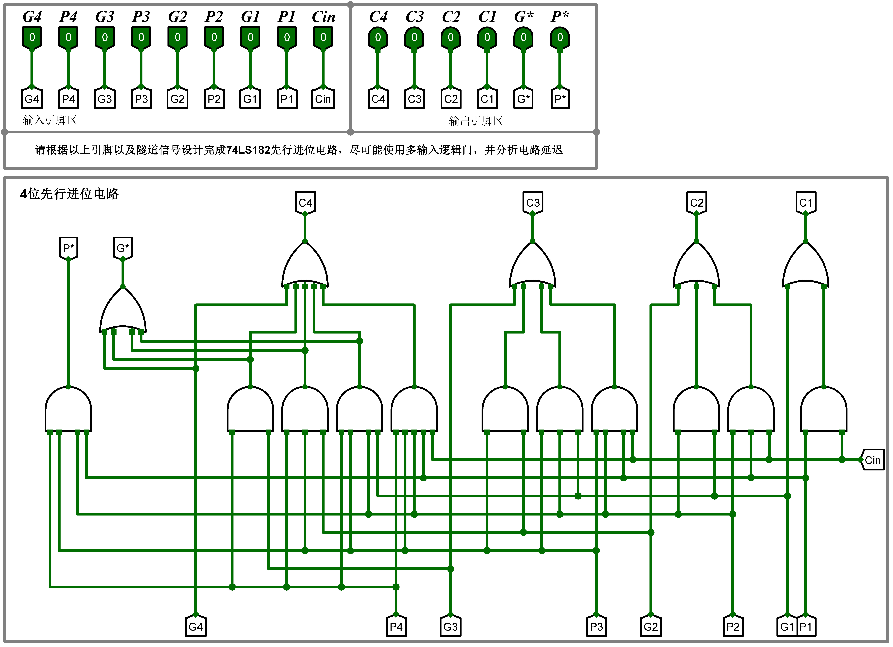
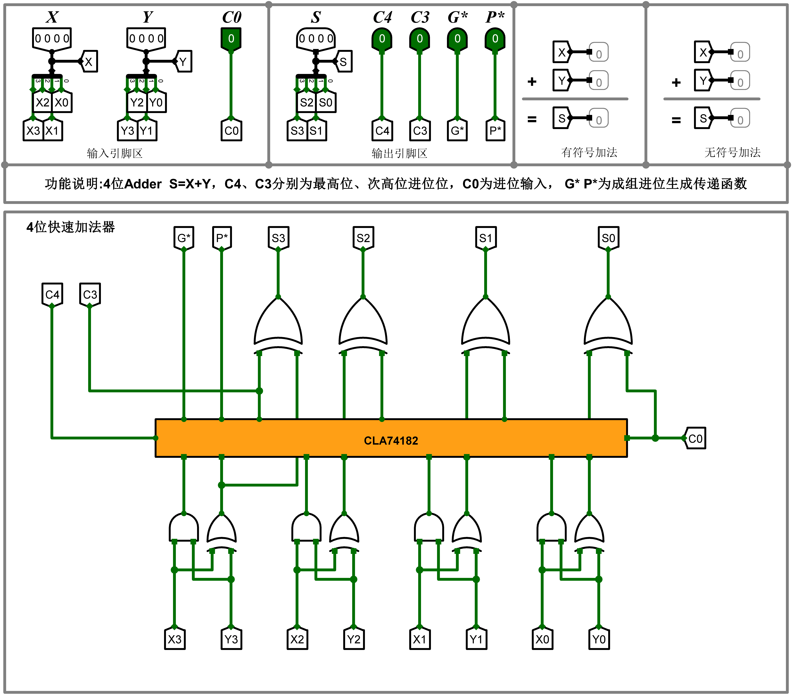

# Lab Assignment 2-2: 4-bit Fast Adder

对应实验课教材第 2.2 节《4 位快速加法器设计实验》

相关封装
* CLA74182 (CLA: Carry Look-Ahead)
* SN74181

## 原理

$$S_i = X_i \oplus Y_i \oplus C_{i-1}$$
$$C_i = X_i \cdot Y_i + (X_i \oplus Y_i) \cdot C_{i-1}$$

令
$$G_i = X_i \cdot Y_i$$
$$P_i = X_i \oplus Y_i$$

则有
$$S_i = P_i \oplus C_{i-1}$$
$$C_i = G_i + P_i \cdot C_{i-1}$$

从而
$$C_1 = G_1 + P_1 C_0$$
$$C_2 = G_2 + P_2 G_1 + P_2 P_1 C_0$$
$$C_3 = G_3 + P_3 G_2 + P_3 P_2 G_1 + P_3 P_2 P_1 C_0$$
$$C_4 = G_4 + P_4 G_3 + P_4 P_3 G_2 + P_4 P_3 P_2 G_1 + P_4 P_3 P_2 P_1 C_0$$

令
$$G^* = G_4 + P_4 G_3 + P_4 P_3 G_2 + P_4 P_3 P_2 G_1$$
$$P^* = P_4 P_3 P_2 P_1$$

则有
$$C_4 = G^* + P^* C_0$$

## 延迟分析

下面的分析假定所有逻辑门的延迟均相同，为 $T$。

> [!NOTE]
> 在实际电路工作时，这一假定并不成立。这里只是根据 Logisim 对延迟的简化处理进行分析。

* 给定输入信号 $X_i, Y_i, i = 0, 1, 2, 3$ 和 $C_0$
* 经过时长为 $T$ 的延迟后，产生 $G_i, P_i, i = 0, 1, 2, 3$
* 经过时长为 $2T$ 的延迟后，产生 $C_j, j = 1, 2, 3, 4$
* 经过时长为 $T$ 的延迟后，产生 $S_j, j = 1, 2, 3, 4$
* 至此，所有输出信号均已产生完毕，共计用时 $4T$

## 结果展示

### 4 位可级联先行进位电路 (CLA74182)

### 4 位快速加法器

