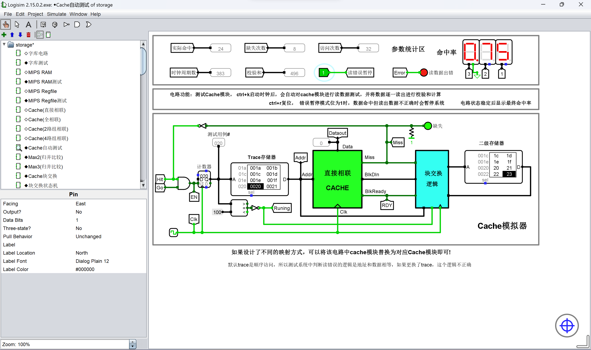
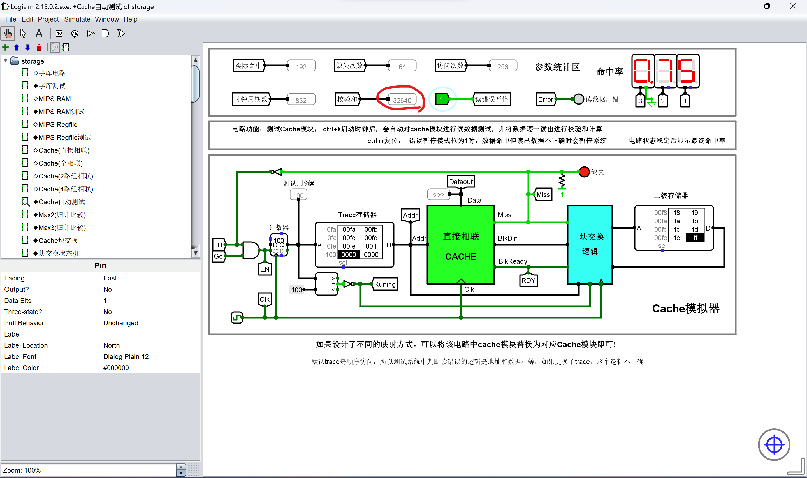

# 直接相联映射 cache 设计实验

## 直接相联映射 cache 的逻辑实现

地址的构成
* 区地址，又称 tag
* 行地址，又称 index
* 字地址，又称 offset

data, tag, valid bit[, dirty bit]

需要注意的是，在直接相联映射 cache 中，查找信息和数据副本是存储在一起的，不需要相联存储器这样一个单独的器件存储查找表。我们将这样一个 cache 数据块与描述该数据块的查找信息与标记信息，称之为 **cache 行** 或 **cache 槽**。

当 cache 收到一个读请求时，
* 首先利用地址中的 index 字段定位对应 cache 槽
* 如果对应的 cache 槽的有效位为 1 且该槽中所存储的 tag 与当前地址的 tag 字段相同，表示数据命中
  * 这个查找过程只需要一个比较器电路即可实现
* 如果数据命中，直接从当前的 cache 槽中访问相应的数据即可
* 否则，需要触发块交换逻辑
  * 将当前地址对应的主存中的数据块调度到当前 cache 槽
  * 如果当前 cache 槽存在数据，需要进行相应的替换处理

## 设计思路

```c
struct address {
    short offset:2;  // 0,1
    short index:3;  // 2,3,4
    short tag:11;  // 5,6,7,8,9,10,11,12,13,14,15
};
```

## 测试结果

### 测试未通过示例



### 测试通过示例


