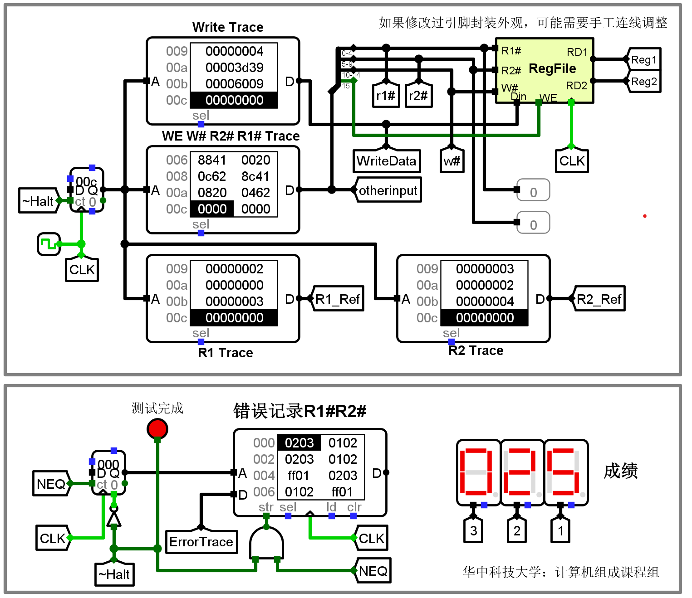
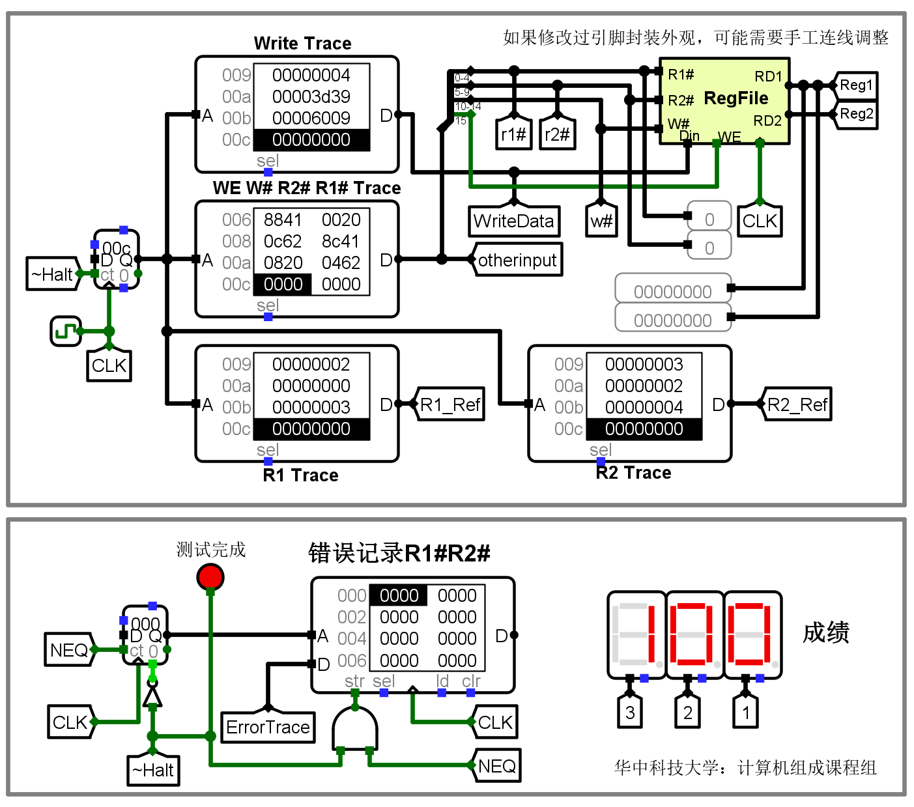

# 寄存器文件设计实验

对应实验课教材第 3.4 节《MIPS 寄存器文件设计实验》

> [!IMPORTANT]
> 为了减少绘图工作量，只需设计包含 4 个寄存器的寄存器文件。相应的封装电路参见 [storage.circ](../extra/hustzc/storage.circ) 文件。
> 
> 在后续的 CPU 设计实验中，可以使用康奈尔大学开发的 [CS3410](../extra/hustzc/cs3410.jar) 组件库中的寄存器文件。

## 实验提示

你可以尝试不同的实现方案。

### 读操作

输出选择
* 多路选择器
* 译码器 + 三态门

思考以上 2 种方案有什么区别。

> [!NOTE]
> 在 MIPS 寄存器文件中，0 号寄存器的值恒为零。

### 写操作

如何实现对指定寄存器的写入操作
* 控制写入数据
* 控制写使能端

* 既可以使用译码器
* 也可以使用解复用器/多路分配器

## 电路设计

敬请期待

## 测试电路

> [!NOTE]
> 虽然不作强制要求，但还是非常推荐同学们通过测试电路检查自己设计的电路的正确性。在测试的过程中可能遇到各种各样奇怪的问题，但通过这些问题，我们可以学到更多：这也正是设计电路的一大乐趣所在。
> 
> 这里举一个我自己的例子。以下是我在解决写操作异常问题时的心路历程。
> 
> 首先，使用 Ctrl-K 运行测试用例，发现错误很多。
>
> 接着，使用 Ctrl-R 复原状态，然后使用 Ctrl-T 进行单步调试，发现计数器的值变为 3 时，发生第一个错误。
> 
> 研究了半天测试用例，并对测试电路稍作修改：增加两个探针，获取读出的两个寄存器的值。
> 
> 于是终于搞明白问题出在哪了，进而在原电路中复现故障，并进一步找到了出错的原因：如果给 decoder 加上一个使能端并与 WE 输入引脚相连，当使能信号为 0 时，decoder 的输出是高阻态而不是 0，然而当寄存器的 en 信号为高阻态时，写操作仍然会进行，这不是我们希望的结果。我们希望当 WE 为 0 时，禁用寄存器的写入操作。
>
> 那么如何解决这个问题？同时我们又不希望在每个寄存器的输入端粘贴一个 WE 标签。注意到 decoder 的输出中只有一个为 1，而 0 号寄存器实际上是不存在的。因此，我们可以给 decoder 输入 0 来达到禁用写的效果！同时不再需要一个额外的使能输入，因为它的行为不符合我们的期待。
>
> 但是这样一来，decoder 就变成只有一个输入。我们希望当 WE 为 1 时，输入给 decoder 的值是 W#，而当 WE 为 0 时，输入给 decoder 的值是 0。也就是如下的伪代码：
> ```
> if WE == 1:
>     decoder = W#
> else
>     decoder = 0
> ```
> 能不能用硬件实现类似于软件的 if-else 逻辑？
> 
> 答案是能！这正是多路选择器 (multiplexor) 的功能。

为了测试寄存器文件这样一个具有复杂时序特性的电路，华中科技大学计算机组成课程组设计了一个寄存器文件的自动测试电路。

测试电路的主要思想是，先写入某一个寄存器，然后将所有寄存器的值读出，与标准答案进行对比。

比如，先写入 0 号寄存器的值，再将 0 到 3 号寄存器的值读出进行比较。然后再写 1 号寄存器，读出所有 4 个寄存器的值进行比较。以此类推，完成所有寄存器的写入，并读出所有寄存器进行比较，以此测试同学们在实际构建电路中存在的问题。

最常见的问题是在实现电路的过程中，写入某一个寄存器，可能会影响到其他寄存器的值。

错误记录存储器 `R1#R2#` 中的每一个数据都是一个 4 位的 16 进制数据
* 高两位表示 `R1#`
* 低两位表示 `R2#`

如果对应的数据非零，表示相应寄存器在当前时刻进行读操作时产生了错误。

注意 `ff` 并不代表出错，只是为了和 0 号寄存器区分开来。

在实际测试的过程中，如果发现了错误，你需要进行具体的分析。可以根据错误记录存储器中存储的测试用例进行故障复现。

最终，你实现的 MIPS 寄存器文件应该能够在测试完成时获得 100 分。

### 测试未通过示例截图



### 测试通过示例截图


